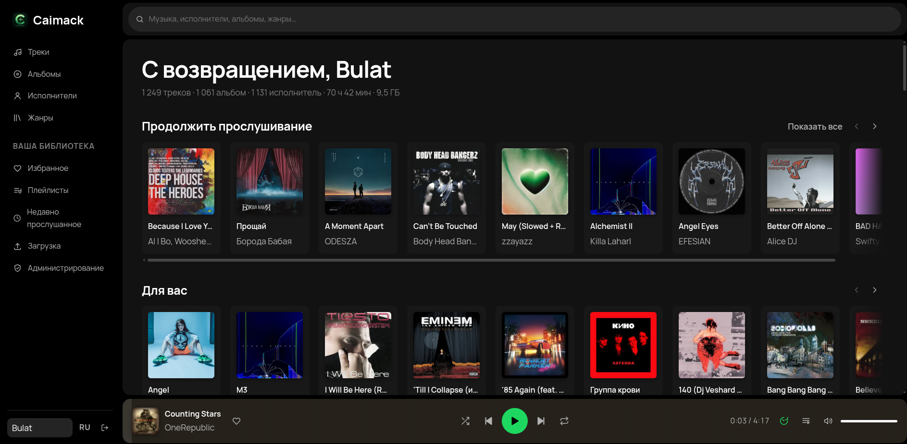
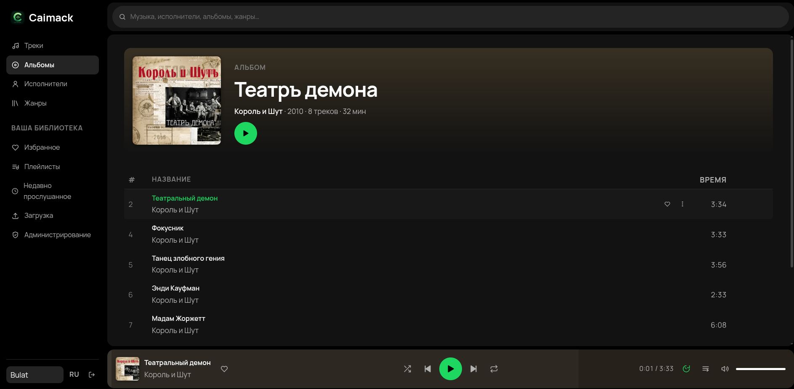
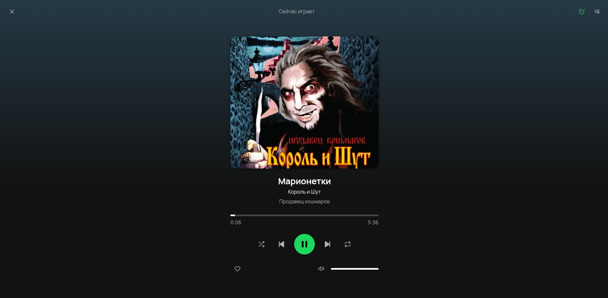

<h1 align="center">Caimack</h1>


<p align="center"> <strong>Personal music streaming service for your own library.</strong> </p>

<p align="center"> Self-hosted · Private · Simple </p>


<p align="center">     </p>


## Screenshots

<p align="center">
  
</p>

<p align="center">
  
  &nbsp;
  
</p>

<p align="center">
  <a href="docs/SCREENSHOTS.md">View all screenshots →</a>
</p>


## Quick start

```bash
git clone <this repo>
cd music-streaming

cp .env.example .env
$EDITOR .env

docker compose up -d
```

Required variables:

```env
POSTGRES_PASSWORD=
JWT_SIGNING_KEY=
OWNER_PASSWORD=
PUBLIC_DOMAIN=
```


## Local development

Two terminals, with PostgreSQL in Docker.

The deployed stack deliberately keeps PostgreSQL off the host network, so local development
uses an override file that publishes it on loopback only:

```bash
docker compose -f docker-compose.yml -f docker-compose.dev.yml up -d postgres

# terminal 1 — API on http://localhost:5199
cd backend/src/MusicStreaming.Api
dotnet run

# terminal 2 — frontend on http://localhost:3000
cd frontend
npm install
npm run dev
```


<p align="center">
  <sub>Built for personal music libraries.</sub>
</p>
