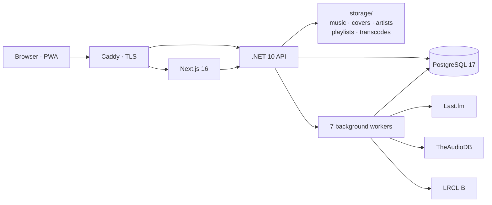

<h1 align="center">Caimack</h1>

<p align="center"> <strong>Personal music streaming service for your own library.</strong> </p>

<p align="center"> Self-hosted · Private · Simple </p>

<p align="center">
  
  
  
  
  
  
</p>

Point it at a folder of your own music, and it becomes a streaming service for you and the handful
of people you trust: transcoded on the fly, recommended from what you actually listen to, and
buffered for patchy mobile connections. One `docker compose up`, one machine, no accounts anywhere else.


<p align="center">
  
  
  
  
</p>


## What it does

**Library**

- Upload `.mp3`, `.flac`, `.m4a` — files stream straight into storage, tags are read in the browser,
  and duplicates are caught before the file is sent
- Albums, artists, genres and playlists; playlists can be public and reordered by dragging
- Covers pulled out of the files, stored at 640 px and 256 px; a newly created artist gets a
  background photo lookup through TheAudioDB
- Full-text search over tracks, albums, artists and genres
- Admins edit track and artist details in place, and delete in bulk

**Listening**

- Adaptive HLS at 64 / 128 / 192 kbps plus the original file, with automatic quality reduction when
  a mobile connection becomes unstable
- A bounded transport cache keeps the current track and the next two ready for patchy city coverage;
  original files can still be downloaded explicitly
- Queue you can drag around, *play next*, save as a playlist, and undo
- Shuffle, repeat, and radio that keeps going when the queue runs out
- Time-synced lyrics, read from the file's tags and fetched from LRCLIB in the background when a
  newly uploaded track arrives without them
- Position, artwork and seeking on the OS lock screen; media keys work
- Keyboard shortcuts everywhere, a ⌘K command palette, and a sleep timer that fades out

**Discovery**

- Home feed with a daily mix, fresh arrivals, your top of the week and *jump back in*
- Recommendation shelves built from real listening events: ingest → profile rollups → scored
  candidates → diversified shelves, with a share of deliberate exploration
- Radio seeded from any track
- Listening history and personal statistics

**Everything else**

- Dark and light themes, English and Russian, accent colour lifted from the current cover
- Last.fm scrobbling, delivered through a generic outbox so a dead API never loses a play
- Prometheus, Loki, Promtail and Grafana ship in the same compose file
- JWT access and refresh tokens; the first admin is seeded from `.env`

## How it is put together




## Quick start

```bash
git clone <this repo>
cd music-streaming

cp .env.example .env
$EDITOR .env

docker compose up -d
```

At minimum you must fill in:

```env
POSTGRES_PASSWORD=      # openssl rand -base64 48
JWT_SIGNING_KEY=        # openssl rand -base64 48
OWNER_PASSWORD=         # the first admin account
PUBLIC_DOMAIN=          # Caddy asks Let's Encrypt for this name
```

Everything else has a working default — see [.env.example](.env.example), which explains each
variable next to it. Images come prebuilt from GHCR, so nothing is compiled on the server. To build
them yourself:

```bash
docker compose -f docker-compose.yml -f docker-compose.build.yml up -d --build
```

Automatic enrichment is best-effort and deliberately never holds an upload request open. It asks
[LRCLIB](https://lrclib.net) only for newly uploaded tracks that carry no lyrics at all, so anything
read out of a file's tags or typed in by hand stays as it is.

Grafana and the API schema are not exposed publicly — reach them through an SSH tunnel:

```bash
ssh -L 3001:127.0.0.1:3001 you@server   # → http://localhost:3001      Grafana
ssh -L 8080:127.0.0.1:8080 you@server   # → http://localhost:8080/docs API schema
```

## Releasing

```bash
scripts/release.sh x.y.z
git push origin master && git push origin vx.y.z
```

On the server:

```bash
scripts/deploy.sh x.y.z
```


Packages published to GHCR start out private. Log the server in
once with a classic token carrying the `read:packages` scope:

```bash
echo "$GHCR_TOKEN" | docker login ghcr.io -u bulatruslanovich --password-stdin
```

## Local development

The deployed stack keeps PostgreSQL off the host network, so local work uses an override file that
publishes it on loopback only. One command brings up all three:

```bash
make dev        # postgres in Docker + API on :5199 + frontend on :3000
```

Or piece by piece:

```bash
make db         # just PostgreSQL
make backend    # dotnet watch run
make frontend   # next dev
make test       # backend tests — needs Docker for Testcontainers
```


## License

MIT — see [LICENSE](LICENSE). Every source file carries a two-line SPDX header; the header is added
and verified by `scripts/license-headers.sh`, which CI runs on every push.

<p align="center">
  <sub>Built for personal music libraries.</sub>
</p>
