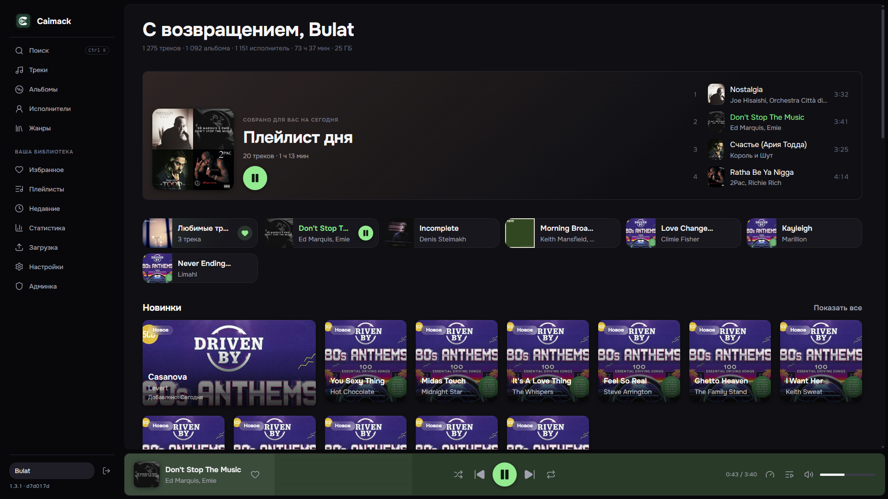
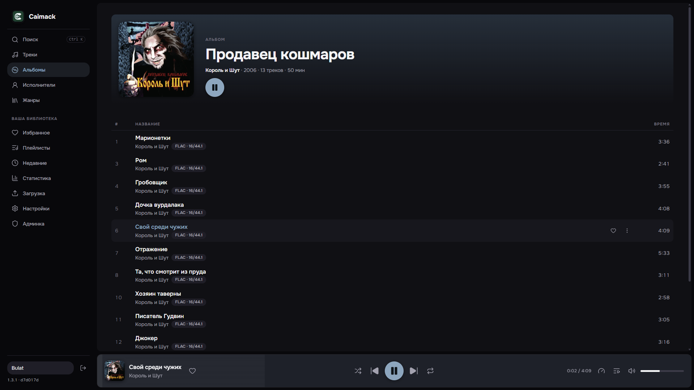
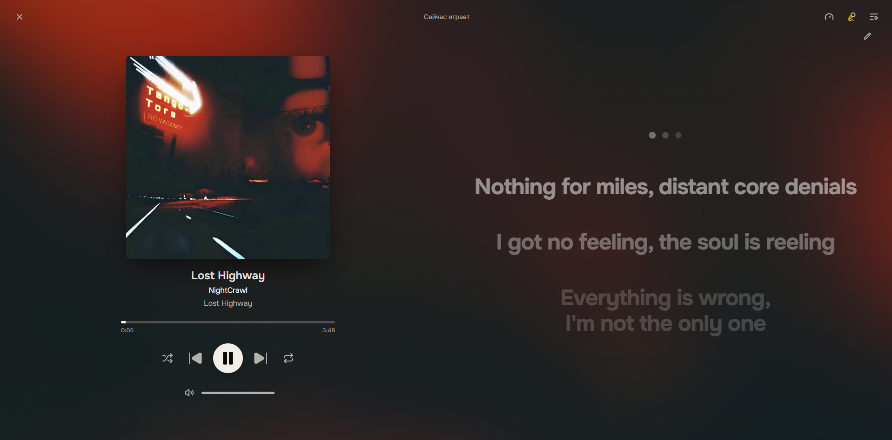
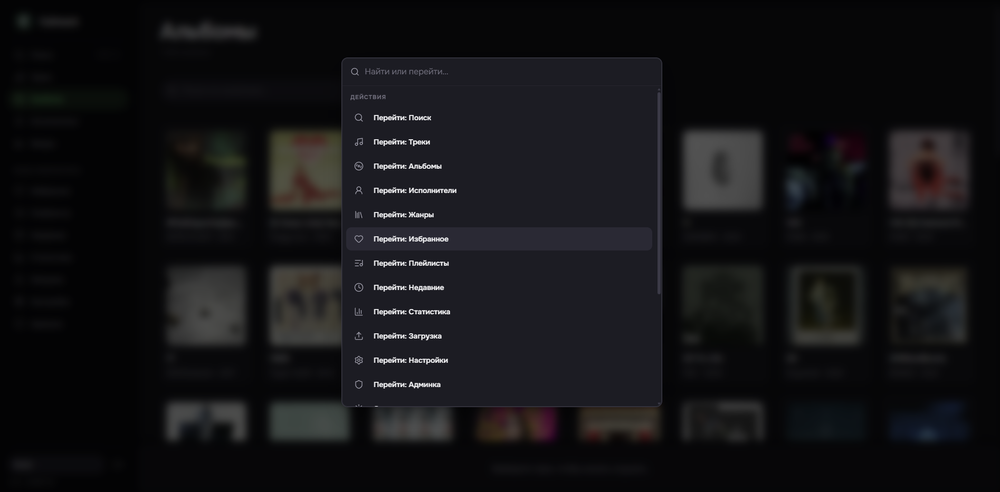

<h1 align="center">Caimack</h1>

<p align="center"><strong>Your music library, streamed from your own server.</strong></p>

<p align="center">Self-hosted · Private · Built for everyday listening</p>

<p align="center">
  
  
  
  
</p>

Caimack turns a personal music collection into a private streaming service. Upload your library,
invite the people you trust, and listen from any browser without giving your collection or listening
history to another platform.

<p align="center">
  
  
  
  
</p>

## Highlights

- **Reliable on changing mobile networks.** Adaptive HLS switches between 64, 128 and 192 kbps,
  while a bounded cache prepares the current track and the next two for patchy coverage.
- **Recommendations from your own listening.** Daily mixes, radio and discovery shelves learn from
  real plays while keeping the data on your server.
- **A complete music player.** Synced lyrics, an editable queue, shuffle, repeat, sleep timer, media
  keys and lock-screen controls work together across desktop and mobile.
- **A library you control.** Upload MP3, FLAC and M4A files, organize albums and playlists, search the
  whole collection and download original files whenever you need them.
- **Simple private hosting.** The application, database, HTTPS proxy and monitoring stack run from
  one Docker Compose setup with no external account required.

## Quick start

```bash
git clone <this repo>
cd music-streaming
cp .env.example .env
$EDITOR .env
docker compose up -d
```

Set these values before the first start:

```env
POSTGRES_PASSWORD=   # openssl rand -base64 48
JWT_SIGNING_KEY=     # openssl rand -base64 48
OWNER_PASSWORD=      # password for the first admin account
GRAFANA_PASSWORD=    # password for the private monitoring dashboard
PUBLIC_DOMAIN=       # domain for the automatic HTTPS certificate
```

All optional settings and their defaults are documented in [.env.example](.env.example). Prebuilt
images are pulled from GHCR. To build the application locally instead:

```bash
docker compose -f docker-compose.yml -f docker-compose.build.yml up -d --build
```

## Development

```bash
make install     # install frontend dependencies
make dev         # PostgreSQL + API + frontend
make test        # backend tests
```

The API runs on `http://localhost:5199` and the frontend on `http://localhost:3000`.

## License

MIT — see [LICENSE](LICENSE).
