<h1 align="center">Caimack</h1>

<p align="center"><strong>Your music library, streamed from your own server.</strong></p>

<p align="center">Self-hosted · Private · Web and Android · Recommendations that never leave the box</p>

<p align="center">
  
  
  
  
  
  
</p>

<p align="center">
  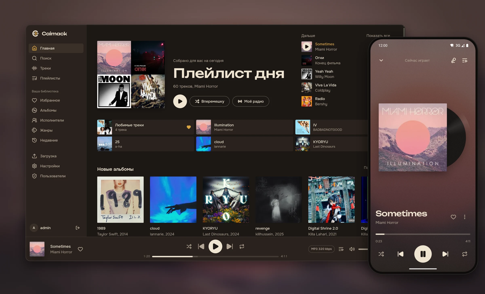
</p>

Caimack turns a personal music collection into a private streaming service. Upload your MP3 and
FLAC files, invite the people you trust, and listen from a browser or the Android app. The
server learns what you like from what you actually play, and that data stays on your hardware.

## Highlights

- **Recommendations from your own listening.** A daily mix, personal radio and "for you" shelves
  are built from real plays, skips and favourites. Every track is analysed by a local CLAP audio
  model, so radio can follow how songs *sound*, not only who made them.
- **Radio for a mood.** Workout, drive, focus, sleep, happy, sad: one tap starts a radio of your
  own library that fits the mood and your taste. Moods are text prompts matched against the same
  CLAP audio embeddings, so no tags or manual sorting are needed.
- **Monthly recap.** For the first week of every month, a story-style recap of the previous one:
  hours of music, artist and track of the month, the busiest day, when you listen, the mood the
  month sounded like and the one track that sums it up.
- **Synced lyrics.** Lyrics follow the song line by line in the full-screen player; they're
  fetched from LRCLIB automatically and can be edited by hand.
- **Steady playback on bad networks.** Adaptive HLS moves between 64 kbps, 128 kbps and the
  original file, while the browser keeps a bounded stream cache for patchy coverage.
- **One session across devices.** Start a track on the phone, see it on the desktop and pick it
  up with "Continue here", position included.
- **A full player.** Editable queue with drag and drop, "keep going with similar tracks",
  shuffle, repeat, crossfade, an equalizer, media keys, lock-screen controls and keyboard
  shortcuts (press `?`).
- **A native Android client.** Kotlin, Jetpack Compose and Media3, with offline downloads,
  Android Auto and a quick-settings tile that starts your radio in one tap.
- **A library you control.** Drag in files or whole folders, edit tags and artwork, build
  playlists, browse by genre and download the original files whenever you want.
- **Simple private hosting.** Application, database and HTTPS proxy come up from a single
  Docker Compose file, with no external account required.

## A look around

<p align="center">
  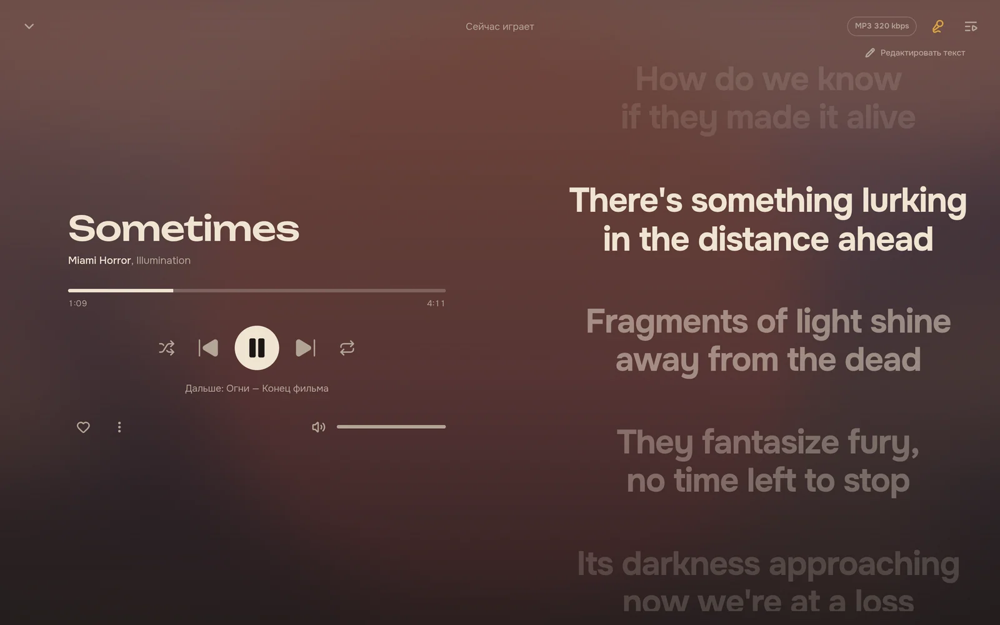
</p>

<p align="center"><sub>The full-screen player builds its backdrop from the cover art of whatever is
playing; synced lyrics highlight the current line.</sub></p>

<table>
  <tr>
    <td width="50%">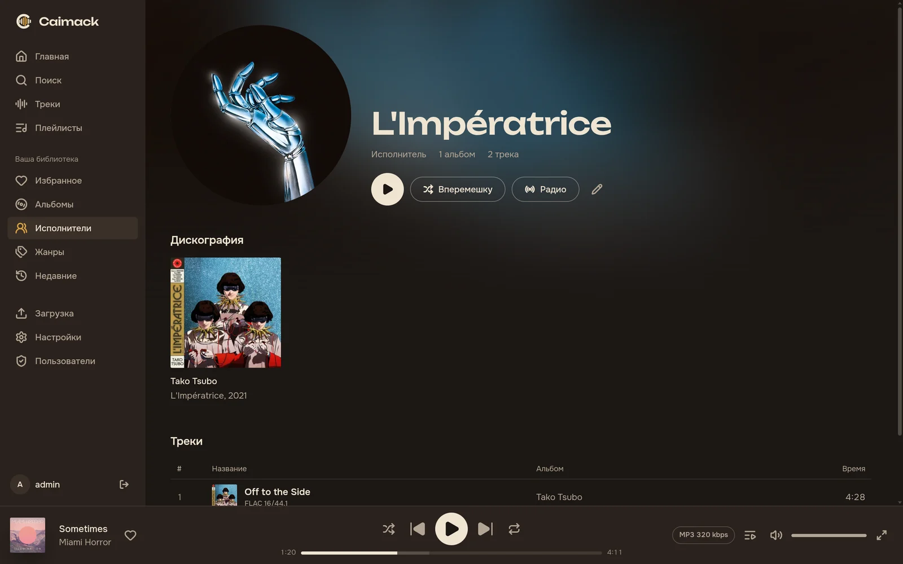</td>
    <td width="50%">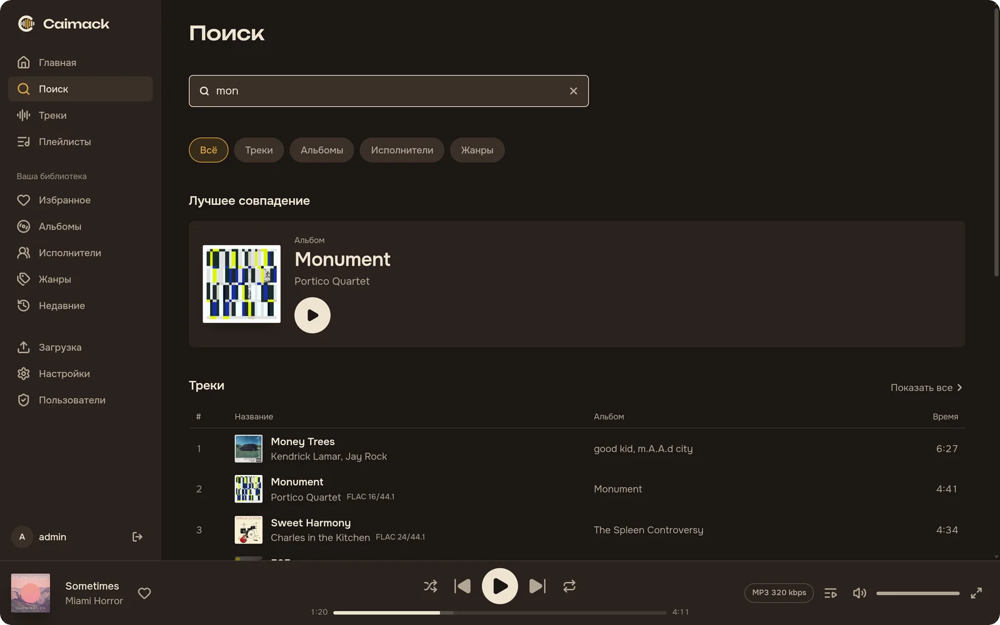</td>
  </tr>
  <tr>
    <td align="center"><sub>Artist pages pick their colours up from the artist photo</sub></td>
    <td align="center"><sub>Search across tracks, albums, artists and genres</sub></td>
  </tr>
  <tr>
    <td width="50%">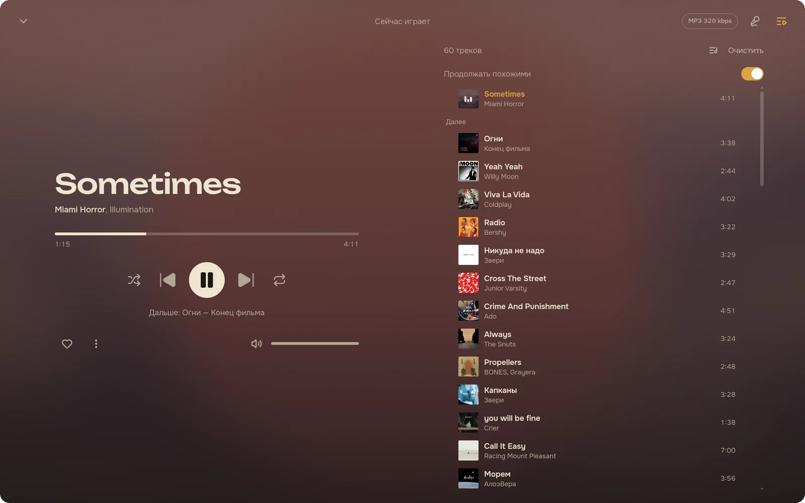</td>
    <td width="50%">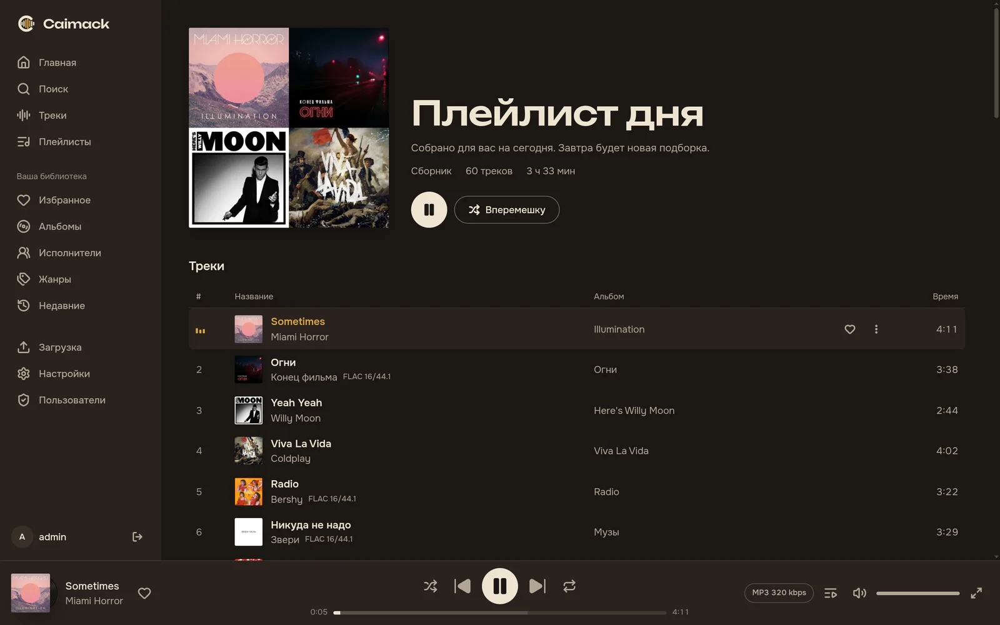</td>
  </tr>
  <tr>
    <td align="center"><sub>The queue, with "keep going with similar tracks"</sub></td>
    <td align="center"><sub>A new playlist of the day every morning</sub></td>
  </tr>
</table>

<p align="center">
  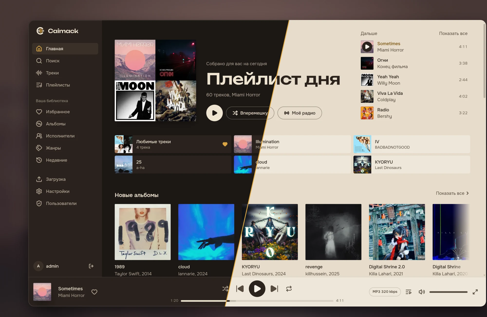
</p>

<p align="center"><sub>Dark and light themes, following the system by default.</sub></p>

### On the phone

The web app is a PWA with its own mobile layout, and there is a native Android client as well.

<p align="center">
  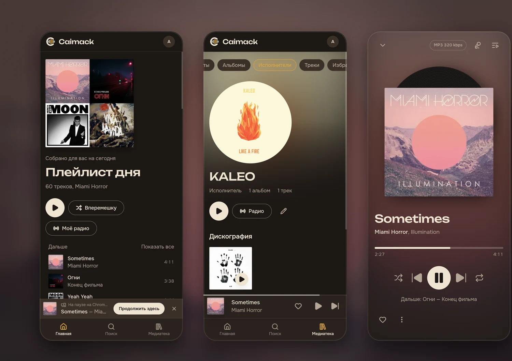
</p>

<p align="center">
  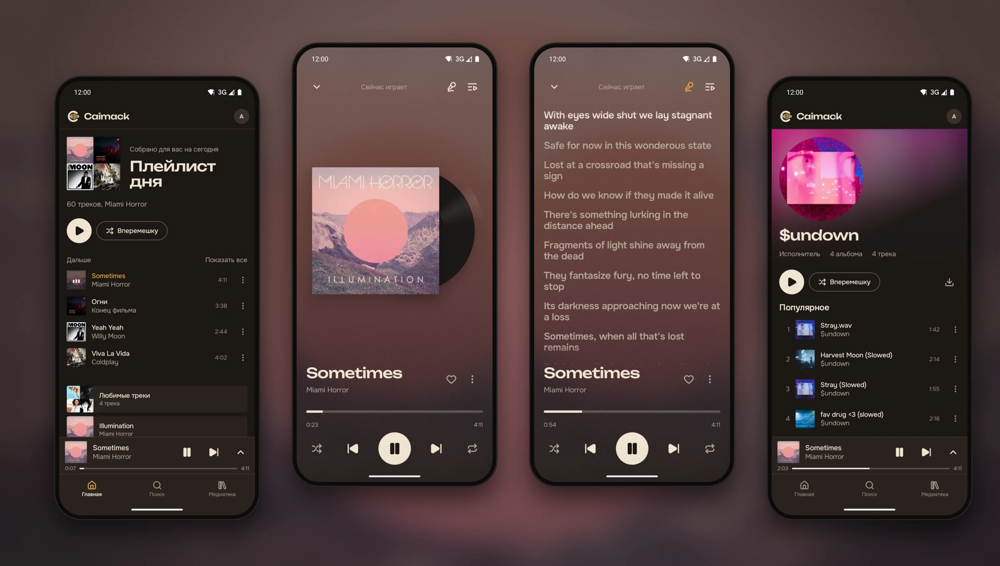
</p>

<details>
<summary>More screens</summary>

<br>

| | |
| --- | --- |
| 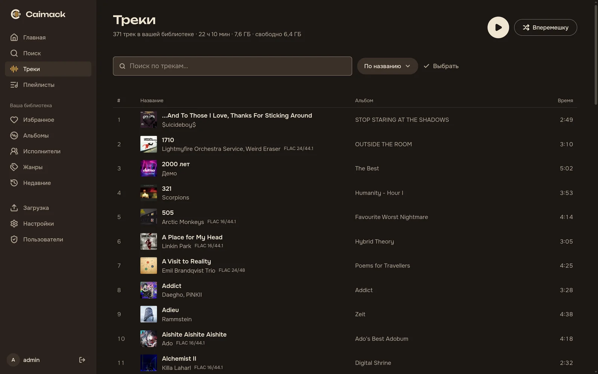 | 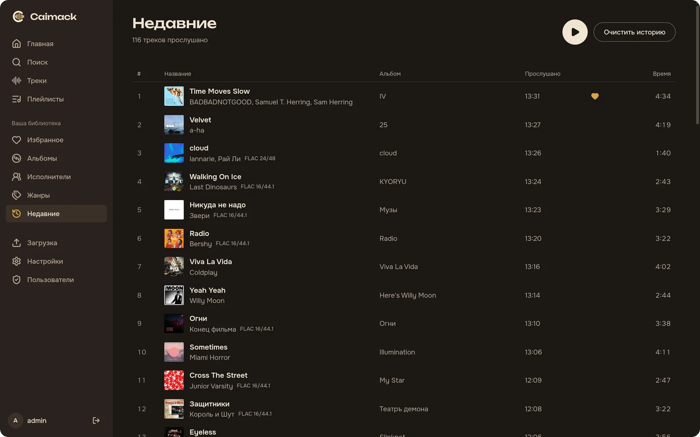 |
| All tracks, with sorting and bulk selection | Listening history |
| 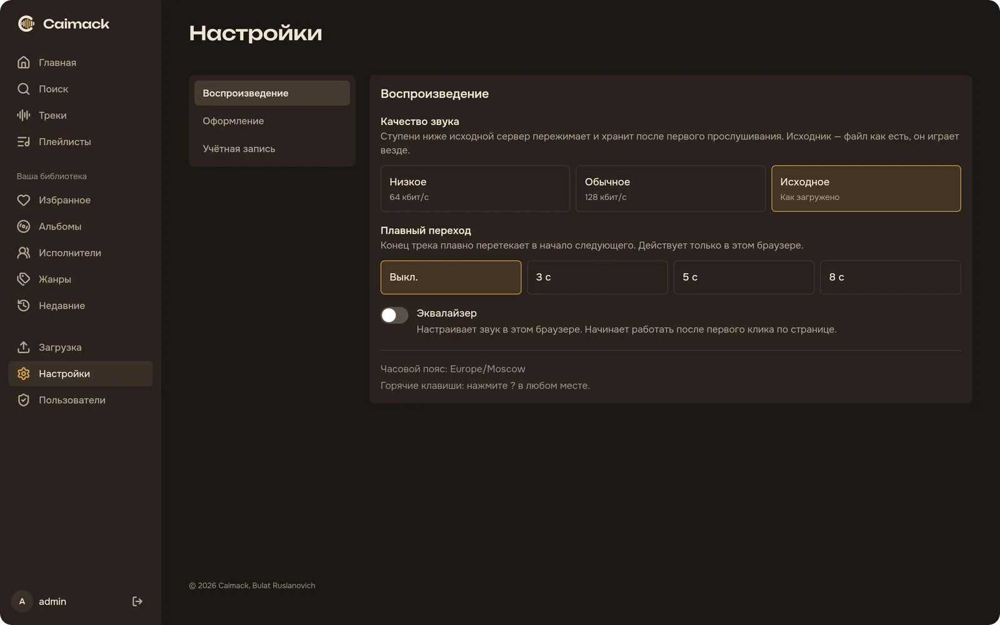 | |
| Stream quality, crossfade and equalizer | |

</details>

## How it fits together

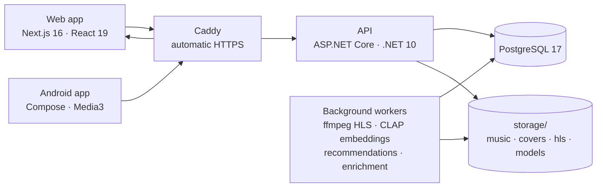
```mermaid
flowchart LR
    web["Web app<br/>Next.js 16 · React 19"]
    android["Android app<br/>Compose · Media3"]
    caddy["Caddy<br/>automatic HTTPS"]
    api["API<br/>ASP.NET Core · .NET 10"]
    workers["Background workers<br/>ffmpeg HLS · CLAP embeddings<br/>recommendations · enrichment"]
    db[("PostgreSQL 17")]
    disk[("storage/<br/>music · covers · hls · models")]

    web --> caddy
    android --> caddy
    caddy --> api
    caddy --> web
    api --> db
    api --> disk
    workers --> db
    workers --> disk
```

| Part | What it does |
| --- | --- |
| `backend/` | ASP.NET Core API with EF Core. Background workers transcode uploads to HLS with ffmpeg, compute CLAP audio embeddings through ONNX Runtime, refresh recommendations, and look up lyrics (LRCLIB) and artist photos (Deezer). |
| `frontend/` | Next.js app with TanStack Query and hls.js. A service worker caches the shell, artwork and stream segments. |
| `android/` | Kotlin client using Jetpack Compose and Media3: background playback, downloads, Android Auto and a quick-settings radio tile. |
| `db/` | The database schema as plain SQL. The backend never migrates anything; see [db/README.md](db/README.md). |
| `deploy/` | Caddyfile for the reverse proxy. |

## Quick start

```bash
git clone https://github.com/BulatRuslanovich/music-streaming.git
cd music-streaming
cp .env.example .env
$EDITOR .env
docker compose up -d
```

Set these values before the first start:

```env
POSTGRES_PASSWORD=   # openssl rand -base64 48
JWT_SIGNING_KEY=     # openssl rand -base64 48
OWNER_PASSWORD=      # password for the first admin account
PUBLIC_DOMAIN=       # domain for the automatic HTTPS certificate
```

The backend needs the CLAP audio model and won't start without it. Exporting the model takes
PyTorch and several GB of RAM, so it's built only on demand under the `model` profile. Build it on
a workstation and copy it to the server's storage:

```bash
make model   # or: docker compose --profile model run --rm clap-model
rsync -a storage/models/ server:/path/to/storage/models/
```

Then open `https://<PUBLIC_DOMAIN>`, sign in as the owner and drop your music onto the Upload
page. New accounts are created by an admin on the Users page.

## Development

You'll need the .NET 10 SDK, Node.js, Docker and, for the Android client, the Android SDK.

```bash
make db          # Postgres in Docker, bound to loopback
make backend     # API on http://localhost:5199 (exports the CLAP model first if it's missing)
make install     # npm install for the frontend
make frontend    # next dev, proxies /api to the backend
```

`make help` lists everything. The one that matters before a push is `make check`: formatting,
lint and both test suites, the same as CI.

To work on the frontend against another backend, point the dev proxy at it:

```bash
cd frontend && BACKEND_INTERNAL_URL=https://music.example.com npm run dev
```

### Android

```bash
make android-release   # android/app/build/outputs/apk/release/app-release.apk
```

The app runs on Android 13 and newer. The server address is entered on the sign-in screen, so a
single build works with any Caimack server.

## License

MIT — see [LICENSE](LICENSE).
