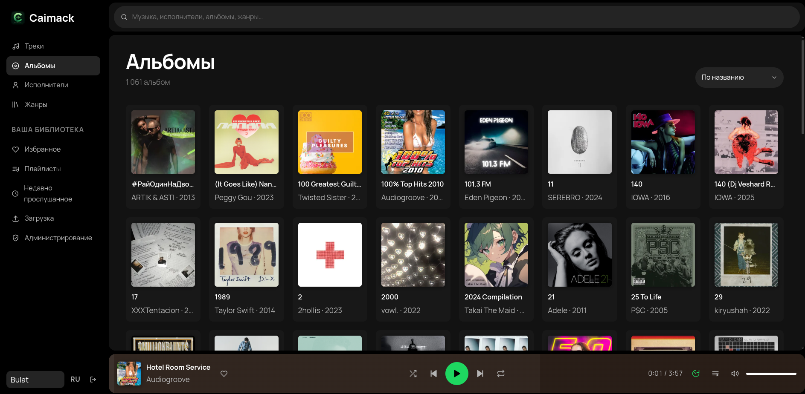
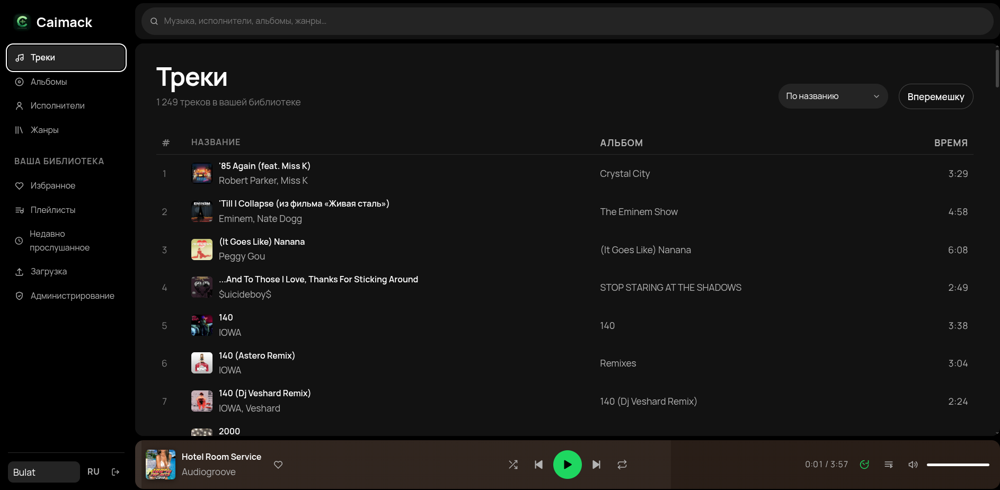
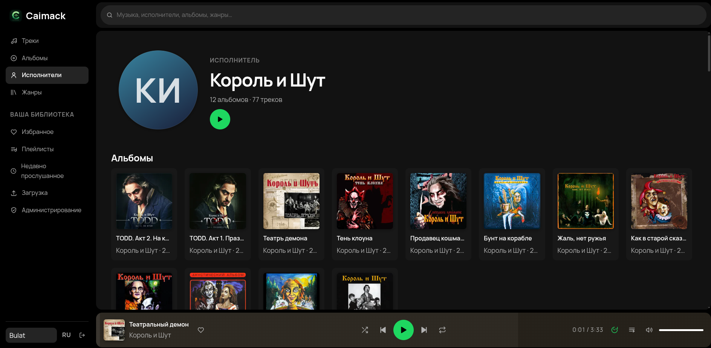
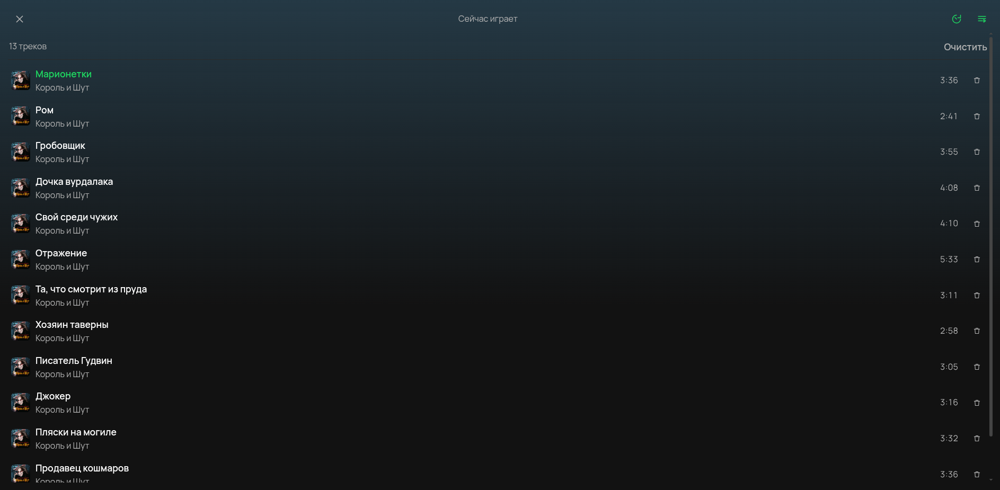
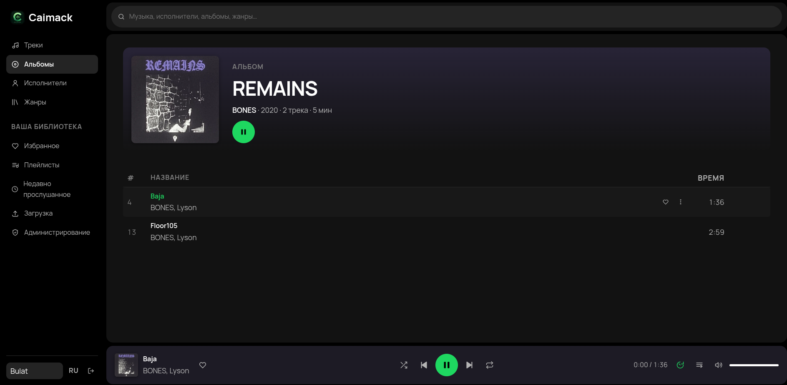
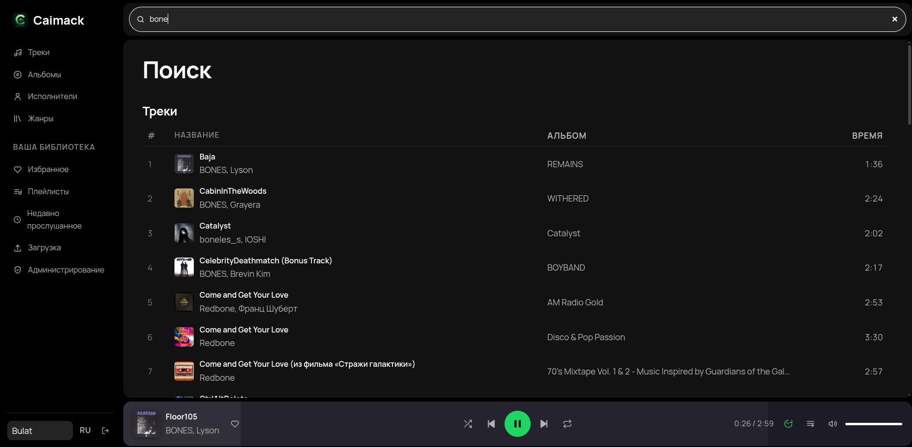
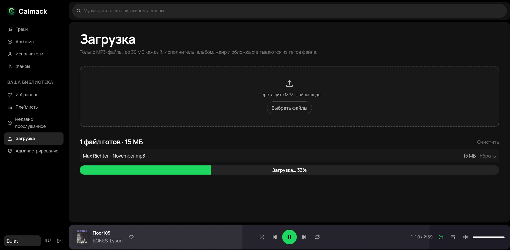
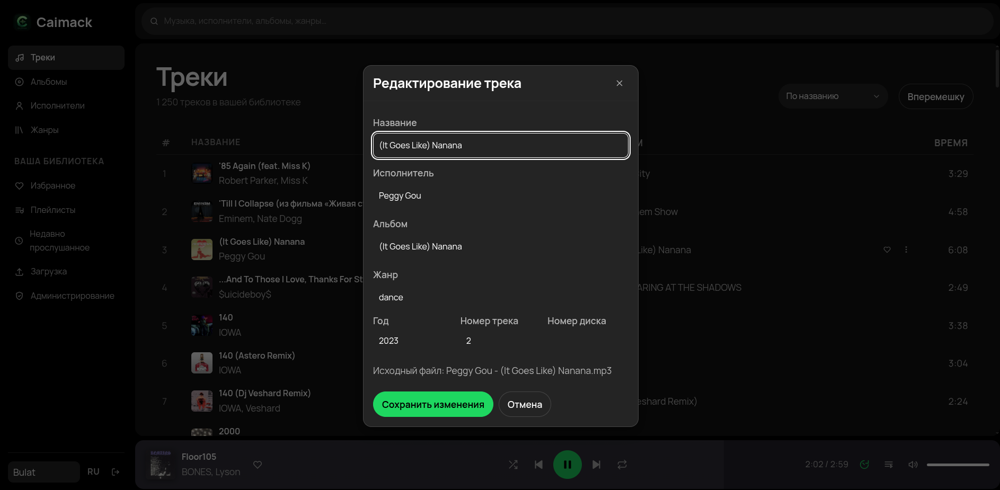
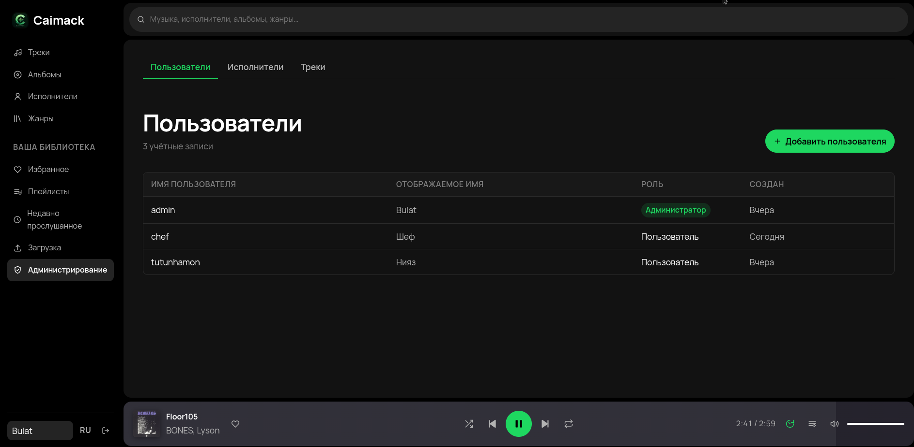
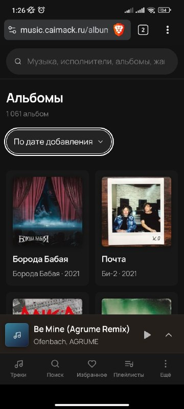

# Screenshots

A tour of Caimack. Back to the [README](../README.md).

---

### Home

The library summary, freshly added albums and playlists, and recommendation shelves built
from listening history.

<!-- shot: / , logged in, library with at least a dozen tracks so the shelves are filled -->

---

### Library

Tracks, albums, artists and genres — each a paged, sortable view of what you uploaded.

<!-- shot: /albums , grid of album covers -->

<!-- shot: /tracks , track list with covers, durations and the row menu open on one track -->

---

### Album page

Cover art, the track list, and a background tinted from the artwork.

<!-- shot: /albums/{id} for an album with real cover art and 8+ tracks -->

---

### Artist page

Everything by one artist: albums first, then the rest of the tracks.

<!-- shot: /artists/{id} for an artist with more than one album -->

---

### Player and queue

The player sits at the bottom of every page. It expands into a full-screen view, and the
queue panel shows what plays next.

<!-- shot: full-screen player open, track playing, seekbar somewhere mid-track -->

<!-- shot: queue panel open with several queued tracks -->

---

### Playlists

Build playlists from any track menu, reorder them, and give them a cover.

<!-- shot: /playlists/{id} for a playlist with a cover and 10+ tracks -->

---

### Search

One search box across tracks, albums, artists and playlists.

<!-- shot: /search with a query typed in and results in several categories -->

---

### Upload

Drop MP3s in; tags, cover art and duration are read from the files, and anything wrong can
be fixed before or after saving.

<!-- shot: /upload mid-upload, a few files listed with progress or parsed tags visible -->

<!-- shot: the edit-track dialog open over the track list -->

---

### Admin

Accounts, artists and tracks, for whoever runs the server.

<!-- shot: /admin/users with a couple of accounts listed -->

---

### Mobile

The same app on a phone-width screen.

<!-- shot: home page + player at ~390px wide, e.g. browser devtools iPhone preset -->

<!-- shot: full-screen player at the same width -->

