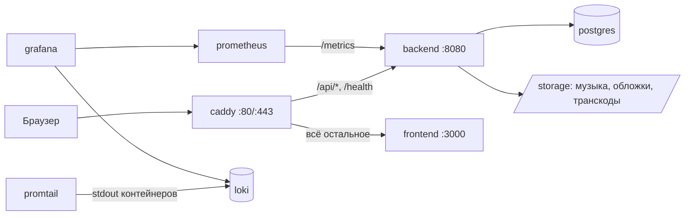

# 01. Обзор

## Что это

Caimack — self-hosted сервис потокового воспроизведения **собственной** музыкальной коллекции.
Владелец разворачивает его на своём сервере, загружает туда свои файлы и слушает их с любого
устройства через браузер. Это не каталог-агрегатор и не витрина чужого контента: всё, что можно
послушать, кто-то предварительно загрузил сам.

Из этого вытекают почти все архитектурные решения, и об этом стоит помнить, читая код дальше.

## Границы

Эти допущения заложены в код и не обсуждаются по ходу отдельных задач:

| Допущение | Что из него следует |
|---|---|
| **Один экземпляр бэкенда** | Очереди между фоновыми процессами — in-memory, эксклюзивность воспроизведения — в памяти процесса, кэш полок частично в `IMemoryCache`. Запуск второй реплики приведёт к тихой порче поведения, а не к ошибке. См. [ADR-0027](adr/0027-single-instance-deployment.md) |
| **Десятки пользователей, не тысячи** | Рекомендации пересчитываются целиком по пользователю, статистика считается запросами по всей истории, поиск работает через `pg_trgm` без отдельного поискового движка |
| **Пользователи доверенные** | Регистрации нет: учётные записи заводит администратор. Загружать музыку могут только администраторы |
| **Библиотека — десятки тысяч треков** | Похожесть треков считается полным проходом раз в несколько часов, а не онлайн |

## Стек

| Слой | Технология | Версия |
|---|---|---|
| Язык и рантайм | C# / .NET | 10 |
| Веб | ASP.NET Core, контроллеры MVC | 10 |
| БД | PostgreSQL | 17 |
| Доступ к данным | EF Core + Npgsql | 10 |
| Аутентификация | JWT (HS256) + HttpOnly-cookie | — |
| Хранилище файлов | локальная файловая система | — |
| Перекодирование | ffmpeg → Opus | внешний бинарник |
| Теги аудио | TagLibSharp | 2.3 |
| Изображения | SixLabors.ImageSharp | 3.1 |
| Логи | Serilog → stdout | 10 |
| Метрики | OpenTelemetry → Prometheus | 1.17 |
| Схема API | Microsoft.AspNetCore.OpenApi + Scalar | 10 / 2.16 |
| Тесты | xUnit v3 + Testcontainers | 3.1 / 4.1 |

Версии пакетов закреплены в каждом `.csproj` отдельно; централизованного управления версиями
(`Directory.Packages.props`) нет. Общие свойства сборки — в
[`backend/Directory.Build.props`](../../backend/Directory.Build.props).

## Карта репозитория

```
music-streaming/
├── backend/                    ← этой документацией описан он
│   ├── src/
│   │   ├── MusicStreaming.Domain/           сущности и чистые правила
│   │   ├── MusicStreaming.Application/      сценарии, DTO, порты
│   │   ├── MusicStreaming.Infrastructure/   адаптеры, EF Core, фоновые процессы
│   │   ├── MusicStreaming.Api/              контроллеры и композиция приложения
│   │   └── MusicStreaming.Tools.ArtistImages/  отдельная утилита
│   ├── tests/
│   │   ├── MusicStreaming.UnitTests/        чистые функции
│   │   └── MusicStreaming.IntegrationTests/ реальный стек в Testcontainers
│   ├── MusicStreaming.slnx      решение (новый XML-формат, не .sln)
│   ├── Directory.Build.props    версия, TFM, nullable для всех проектов
│   ├── Dockerfile               три стадии: build / tools / runtime
│   └── .editorconfig
├── frontend/                   Next.js 15, вне этой документации
├── deploy/                     Caddy, Prometheus, Loki, Promtail, дашборды Grafana
├── docs/
│   ├── backend/                ← вы здесь
│   └── SCREENSHOTS.md
├── scripts/release.sh          проставить версию и создать тег
├── storage/                    локальная библиотека (в git не входит)
├── docker-compose.yml          боевой стенд целиком
├── docker-compose.dev.yml      override: публикует порт Postgres на localhost
├── .env.example                шаблон переменных окружения
└── Makefile                    ярлыки для локальной разработки
```

## Проекты решения

Решение [`backend/MusicStreaming.slnx`](../../backend/MusicStreaming.slnx) содержит семь проектов в
трёх папках. Размеры даны, чтобы было понятно, где сосредоточен код.

| Проект | Файлов | Строк | Зачем |
|---|---:|---:|---|
| `MusicStreaming.Domain` | 25 | ~1 100 | Сущности, перечисления, чистые доменные хелперы. **Ноль зависимостей**, включая NuGet |
| `MusicStreaming.Application` | 78 | ~9 200 | Сценарии использования: сервисы, DTO, настройки, порты во внешний мир, движок рекомендаций |
| `MusicStreaming.Infrastructure` | 30 | ~10 200 | Реализации портов: EF Core, файловое хранилище, ffmpeg, TagLib, ImageSharp, BCrypt, JWT, Last.fm, шесть фоновых процессов |
| `MusicStreaming.Api` | 30 | ~1 800 | 19 контроллеров, одно middleware, шесть файлов настройки хоста. Тонкий слой |
| `MusicStreaming.Tools.ArtistImages` | 3 | ~230 | Отдельная консольная утилита: подтягивает фото исполнителей из TheAudioDB. Запускается вручную, в основном процессе не участвует |
| `MusicStreaming.UnitTests` | 17 | — | Чистая логика: нормализация, разбор имён, пагинация, вся математика скоринга |
| `MusicStreaming.IntegrationTests` | 23 | — | Приложение целиком поверх настоящего Postgres |

Соотношение объёмов показательно: `Api` — самый маленький из содержательных проектов. Контроллер
здесь почти всегда состоит из одной строки, которая передаёт вызов сервису. Так и задумано, подробнее
в [`02-architecture.md`](02-architecture.md).

## Что запускается при `docker compose up`

Бэкенд — один из девяти контейнеров. Подробно в [`13-operations.md`](13-operations.md), здесь — общая
картина, чтобы было понятно, где заканчивается зона ответственности приложения:



Наружу смотрит только Caddy. Порт бэкенда публикуется на `127.0.0.1`, то есть доступен на сервере, но
не из интернета — этим и защищены `/docs` и `/metrics`.

## Куда дальше

Следующий шаг маршрута — [`11-configuration.md`](11-configuration.md): что нужно задать, чтобы
приложение вообще стартовало.
