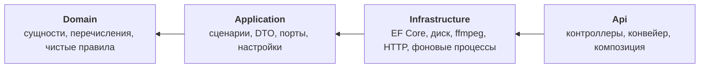

# 02. Архитектура

## Четыре слоя

Бэкенд построен по слоистой схеме (Clean Architecture / «луковица»). Зависимости идут строго в одну
сторону:



## Что лежит в каждом слое

### Domain — `backend/src/MusicStreaming.Domain/`

Сущности, перечисления и несколько чистых функций. **Ни одного NuGet-пакета** — это проверяемая
граница: если кто-то попытается притащить сюда EF Core или ASP.NET, это сразу видно в `.csproj`.

```
Entities/                 Artist, Album, Track, User, Playlist, Favorite, …
Entities/Recommendations/ PlaybackEvent, Affinity, UserTasteProfile, TrackStats, …
Entities/Integrations/    LastfmAccount, OutboundJob
Common/                   Normalize, ArtistNames, AudioQuality
```

Сущности здесь **анемичные**: свойства и почти никакого поведения. Нет базового класса сущности, нет
агрегатов, нет доменных событий. Логика живёт в сервисах слоя Application.

Исключение — чистые функции в `Common/`. `Normalize.Key()` приводит строку к ключу сравнения
(нижний регистр, схлопнутые пробелы), `ArtistNames.Split()` разбирает «A feat. B / C» на список
исполнителей. Они в Domain, потому что от них зависит смысл нормализованных колонок в базе, и они
обязаны вести себя одинаково при загрузке, поиске и сравнении.

### Application — `backend/src/MusicStreaming.Application/`

Самый содержательный слой. Здесь живут сценарии использования.

```
Abstractions/       порты во внешний мир (см. таблицу ниже)
Services/           ~25 сервисов, по одному на предметную область
Services/Recommendations/  конвейер рекомендаций
Services/Integrations/     Last.fm и очередь исходящих
Recommendations/    типы движка рекомендаций
Recommendations/Scoring/   чистая математика скоринга, покрыта юнит-тестами
Dtos/               контракты HTTP-ответов
Options/            классы настроек
Common/             общие хелперы: проекции, пагинация, исключения, валидация значений
```

Сервис — обычный класс, зарегистрированный как `Scoped` в
[`Application/DependencyInjection.cs`](../../backend/src/MusicStreaming.Application/DependencyInjection.cs).

### Infrastructure — `backend/src/MusicStreaming.Infrastructure/`

Реализации портов, по папке на технологию, плюс все фоновые процессы.

```
Persistence/      ApplicationDbContext, Configurations/, Migrations/, DatabaseInitializer
Storage/          FileSystemMusicStorage
Audio/            FfmpegAudioTranscoder, TranscodeWorker
Imaging/          ImageSharpImageProcessor, CoverBackfillService
Metadata/         TagLibAudioMetadataReader
Security/         BCryptPasswordHasher, JwtTokenService, DataProtectionSecretProtector
Integrations/     LastfmClient, OutboundJobWorker, OutboundRetry
Recommendations/  EventIngestWorker, RecommendationWorker, LibraryMaintenanceWorker, SimilarityMaintenance
```

### Api — `backend/src/MusicStreaming.Api/`

Самый тонкий слой: 19 контроллеров, одно middleware и шесть файлов настройки хоста в `Startup/`.

## Порты и адаптеры

Всё, что уводит за пределы процесса, объявлено интерфейсом в
[`Application/Abstractions/`](../../backend/src/MusicStreaming.Application/Abstractions/) и
реализовано в Infrastructure.

| Порт | Адаптер | Что за ним |
|---|---|---|
| `IApplicationDbContext` | `Persistence/ApplicationDbContext` | PostgreSQL через EF Core |
| `IMusicStorage` | `Storage/FileSystemMusicStorage` | Файлы на диске |
| `IAudioMetadataReader` | `Metadata/TagLibAudioMetadataReader` | Чтение тегов (TagLibSharp) |
| `IAudioTranscoder` | `Audio/FfmpegAudioTranscoder` | Внешний процесс ffmpeg |
| `IImageProcessor` | `Imaging/ImageSharpImageProcessor` | Ресайз обложек (ImageSharp) |
| `IPasswordHasher` | `Security/BCryptPasswordHasher` | BCrypt |
| `ITokenService` | `Security/JwtTokenService` | Выпуск JWT и refresh-токенов |
| `ISecretProtector` | `Security/DataProtectionSecretProtector` | Шифрование чужих секретов (ASP.NET Data Protection) |
| `ILastfmApi` | `Integrations/LastfmClient` | HTTP к Last.fm |
| `ICurrentUser` | `Api`: `ClaimsPrincipalCurrentUser` | Кто выполняет запрос |

## Фоновые процессы

Шесть `BackgroundService`, все зарегистрированы в
[`Infrastructure/DependencyInjection.cs:126-131`](../../backend/src/MusicStreaming.Infrastructure/DependencyInjection.cs#L126-L131):

| Процесс | Чем занят | Подробности |
|---|---|---|
| `EventIngestWorker` | Единственный писатель событий воспроизведения | [`08`](08-recommendations.md) |
| `RecommendationWorker` | Пересчёт профиля вкуса и полок | [`08`](08-recommendations.md) |
| `LibraryMaintenanceWorker` | Популярность, похожесть, чистка старых событий | [`08`](08-recommendations.md) |
| `TranscodeWorker` | Перекодирование в Opus по очереди | [`07`](07-media-pipeline.md) |
| `OutboundJobWorker` | Доставка исходящих задач (скробблинг) | [`09`](09-integrations.md) |
| `CoverBackfillService` | Разовая переупаковка старых обложек в webp | [`07`](07-media-pipeline.md) |

Общаются они с веб-частью через синглтон-очереди, объявленные в слое Application: `TranscodeQueue`,
`EventIngestQueue`, `RecommendationRefreshQueue`, `PlaybackSessionRegistry`. Очереди — **в памяти
процесса**.

## Куда дальше

[`03-request-lifecycle.md`](03-request-lifecycle.md) — что происходит с запросом, когда он приходит.
