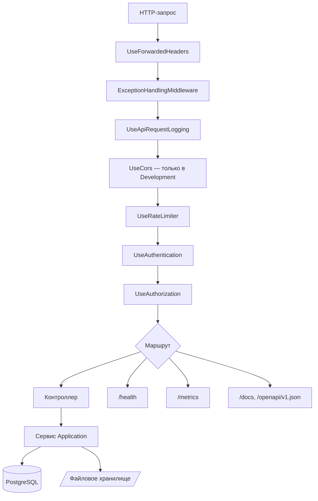

# 03. Жизненный цикл запроса

Всё, что описано ниже, собрано в одном файле —
[`Program.cs`](../../backend/src/MusicStreaming.Api/Program.cs), 72 строки. Держите его открытым.

## Конвейер



Порядок здесь — не случайность, и переставлять элементы нельзя. Почему именно так:

| Позиция | Почему именно здесь |
|---|---|
| `UseForwardedHeaders` — **первым** | Подменяет `RemoteIpAddress` и схему на реальные, взятые из заголовков Caddy. Всё, что стоит дальше, должно видеть уже настоящий адрес клиента: ограничение частоты входа партиционируется по IP, а cookie помечаются `Secure` в зависимости от схемы. Поставьте его после `UseRateLimiter` — и весь лимит логинов будет считаться на один адрес прокси |
| `ExceptionHandlingMiddleware` — **раньше логирования** | Оно ловит исключение и превращает его в ответ. Логирование запросов должно увидеть **итоговый** статус (404, а не «исключение»), поэтому обработчик обязан отработать внутри него… точнее, снаружи: middleware, объявленное раньше, оборачивает всё последующее, и логгер как раз оказывается внутри его `try`. Если поменять их местами, в лог будут падать стектрейсы на каждый обычный 404 |
| `UseCors` — **только в Development** | В бою фронтенд и API живут за одним доменом благодаря Caddy, поэтому CORS не нужен вовсе. Он включается лишь тогда, когда фронт крутится на `localhost:3000`, а API — на `localhost:5199` |
| `UseRateLimiter` — **до аутентификации** | Ограничение на вход должно срабатывать раньше, чем проверка пароля, иначе перебор будет упираться в BCrypt, а не в лимит |
| `UseAuthentication` → `UseAuthorization` | Стандартный порядок: сначала «кто это», потом «можно ли ему» |

## Аутентификация в конвейере

Схема — JWT Bearer, но токен принимается **двумя способами**: из заголовка `Authorization` и из
HttpOnly-cookie `ms_access`. Второй вариант добавлен обработчиком `OnMessageReceived` в
[`Startup/AuthenticationSetup.cs`](../../backend/src/MusicStreaming.Api/Startup/AuthenticationSetup.cs).
Почему так — [ADR-0013](adr/0013-jwt-in-cookie.md), детали — [`06-security.md`](06-security.md).

Ключевое для понимания маршрутов: **политика по умолчанию требует аутентификации**. Любая ручка
закрыта, пока на неё явно не повесили `[AllowAnonymous]`. Забыть закрыть эндпоинт невозможно — можно
только забыть открыть, а это заметно сразу. См. [ADR-0015](adr/0015-secure-by-default.md).

Анонимных мест ровно четыре: `POST /api/auth/login`, `POST /api/auth/refresh`, `POST /api/auth/logout`,
`GET /api/lastfm/callback` (браузер возвращается сюда со стороны Last.fm), плюс служебные `/health`,
`/metrics`, `/docs` и `/openapi/{documentName}.json`.

## Ограничение частоты

Две политики, обе — фиксированное окно в минуту
([`Startup/RequestPipelineSetup.cs:33-60`](../../backend/src/MusicStreaming.Api/Startup/RequestPipelineSetup.cs#L33-L60)):

| Политика | Где применена | Лимит | Разделение |
|---|---|---|---|
| `login` | `POST /api/auth/login` | `Security:LoginAttemptsPerMinute`, по умолчанию 10 | по IP |
| `events` | `POST /api/events` | 120 | по имени пользователя |

Разделение у них разное намеренно. Логины считаются по адресу, потому что атакующий ещё не
представился. Телеметрия — по пользователю, потому что за одним домашним NAT сидит вся семья, и
делить на всех общий бюджет неправильно.

Отказ — `429`, без очереди ожидания (`QueueLimit = 0`).

## Маршрутизация

Контроллеры MVC с атрибутной маршрутизацией. Минимальных API нет, групп маршрутов нет, регистрация —
один `app.MapControllers()`.

Каждый контроллер: `[ApiController]`, `[Route("api/<сегмент>")]`, наследник `ControllerBase`,
зависимости — через первичный конструктор.

| Маршрут | Контроллер | Про что |
|---|---|---|
| `api/auth` | `AuthController` | Вход, обновление токена, выход, «кто я» |
| `api/me` | `MeController` | Настройки, статистика, смена пароля |
| `api/tracks` | `TracksController` | Треки: список, поток, загрузка, правка, текст, обложка, избранное |
| `api/albums`, `api/artists`, `api/genres` | `AlbumsController`, `ArtistsController`, `GenresController` | Каталог |
| `api/playlists` | `PlaylistsController` | Плейлисты и порядок треков в них |
| `api/favorites`, `api/history` | `FavoritesController`, `HistoryController` | Личные списки |
| `api/search`, `api/home` | `SearchController`, `HomeController` | Поиск и главная |
| `api/playback` | `PlaybackController` | SSE-поток управления воспроизведением |
| `api/events` | `EventsController` | Приём телеметрии плеера |
| `api/recommendations` | `RecommendationsController` | Радио, полки, похожие |
| `api/lastfm` | `LastfmController` | Подключение и отключение Last.fm |
| `api/config` | `ConfigController` | Что клиенту нужно знать о сервере (лимиты, доступные качества) |
| `api/system` | `SystemController` | Версия и коммит сборки |
| `api/admin/users` | `AdminUsersController` | Управление учётными записями |
| `api/admin/recommendations` | `AdminRecommendationsController` | Диагностика движка |

Актуальный и полный список ручек с параметрами всегда есть в живом виде: запустите приложение и
откройте **`/docs`**. Дублировать его в Markdown бессмысленно — он устареет к следующему PR.

## Формат ответа

### JSON

Настроен один раз в [`Program.cs:22-28`](../../backend/src/MusicStreaming.Api/Program.cs#L22-L28):

- имена свойств — `camelCase`;
- `null` в ответ не пишется (`JsonIgnoreCondition.WhenWritingNull`);
- перечисления сериализуются **строками**, а не числами (`JsonStringEnumConverter`).

Последнее важно помнить, добавляя значение в enum: строка — часть публичного контракта, переименование
значения ломает клиент. Числовые значения тоже нельзя менять — они лежат в базе. Оба соображения
делают перечисления в этом проекте **append-only**.

### Ошибки

Никаких `if (notFound) return NotFound()` в контроллерах нет. Сервис бросает исключение, и его
превращает в ответ
[`Middleware/ExceptionHandlingMiddleware.cs`](../../backend/src/MusicStreaming.Api/Middleware/ExceptionHandlingMiddleware.cs).

Иерархия — [`Application/Common/AppExceptions.cs`](../../backend/src/MusicStreaming.Application/Common/AppExceptions.cs).
Код ответа хранится в самом исключении:

| Исключение | Код | Когда бросать |
|---|---:|---|
| `ValidationException` | 400 | Входные данные не проходят проверку |
| `AuthenticationException` | 401 | Неверные учётные данные, протухший или отозванный токен |
| `ForbiddenException` | 403 | Пользователь есть, прав не хватает |
| `NotFoundException` | 404 | Объекта нет или он не принадлежит этому пользователю |
| `ConflictException` | 409 | Конфликт состояния: дубликат, занятое имя |
| `UploadTooLargeException` | 413 | Файл больше `Storage:MaxUploadBytes` |

Тело ответа — RFC 7807 `application/problem+json`:

```json
{
  "status": 404,
  "title": "Not Found",
  "detail": "Track not found.",
  "instance": "/api/tracks/019...c3"
}
```

Ещё три случая обрабатываются отдельно:

- `UnauthorizedAccessException` → **403**. Его бросает файловое хранилище, когда вычисленный путь
  вышел бы за пределы корня. Пишется в лог как `Error`: это либо попытка обхода пути, либо ошибка в
  коде, и то и другое стоит увидеть.
- `OperationCanceledException` при `RequestAborted` → **ответа нет вовсе**, запись в лог уровня
  `Debug`. Слушатель перемотал трек или закрыл вкладку. Это происходит постоянно и ошибкой не является.
- Всё остальное → **500** с обезличенным текстом `"An unexpected error occurred."`; подробности
  уходят только в лог.

Ответ не переписывается, если `Response.HasStarted` — иначе посреди уже отданного аудиопотока
попытка приписать JSON порвала бы поток.

## Особые ответы

Не всё в API — это JSON. Три формы, о которых стоит знать заранее:

### Аудиопоток с диапазонами

`GET /api/tracks/{id}/stream`
([`TracksController.cs:54-68`](../../backend/src/MusicStreaming.Api/Controllers/TracksController.cs#L54-L68)):
`enableRangeProcessing: true`, поэтому плеер может запрашивать куски файла и перематывать. ETag имеет
вид `"{contentHash}-{quality}"` — хеш содержимого плюс ступень качества, так что смена качества
корректно инвалидирует кэш браузера. Заголовок — `Cache-Control: private, max-age=604800` (неделя):
содержимое по этому URL неизменно, а `private` не даёт прокси раздать чужой трек.

У `download` та же механика, но `Cache-Control: private, no-store` и имя файла в
`Content-Disposition`.

### Изображения

`this.ImageFile(...)` из [`MediaResults.cs`](../../backend/src/MusicStreaming.Api/MediaResults.cs)
ставит `private, max-age=86400, stale-while-revalidate=604800` и ETag. Сутки свежести плюс неделя,
в течение которой браузер показывает старую обложку и обновляет её в фоне.

### Server-Sent Events

`GET /api/playback/session`
([`PlaybackController.cs`](../../backend/src/MusicStreaming.Api/Controllers/PlaybackController.cs)) —
бесконечный SSE-поток. Устройство держит его открытым, пока играет. Раз в 20 секунд уходит пустое
событие `ping`, чтобы прокси и мобильные операторы не порвали простаивающее соединение. Событие
`displaced` означает «играть начало другое устройство» и завершает поток.

Само наличие подписки и есть заявка на воспроизведение — отдельной ручки «захватить» нет намеренно,
см. [ADR-0024](adr/0024-playback-ownership-via-sse.md).

Для Caddy это важно: в [`deploy/Caddyfile`](../../deploy/Caddyfile) для `/api/*` выставлен
`flush_interval -1`, иначе прокси буферизовал бы поток и события доходили бы пачками.

## Логирование запроса

Одна строка на запрос:
`GET /api/albums/019... → 200 (12.3 ms)`
([`Startup/LoggingSetup.cs:38`](../../backend/src/MusicStreaming.Api/Startup/LoggingSetup.cs#L38)).

Уровень выбирается не только по статусу:

- клиент оборвал соединение → `Debug`;
- исключение или 5xx → `Error`;
- «рутинный» запрос → `Debug`: это `/health`, `/metrics` и любой запрос к `/api/tracks` с заголовком
  `Range`;
- всё остальное → `Information`.

Без этих исключений лог был бы бесполезен: compose опрашивает `/health` каждые 15 секунд, Prometheus
`/metrics` — каждые 30, а один прослушанный трек порождает десятки диапазонных запросов. Подробнее —
[`10-observability.md`](10-observability.md).

## Куда дальше

[`04-domain-model.md`](04-domain-model.md) — что за сущности лежат в конце этого пути.
