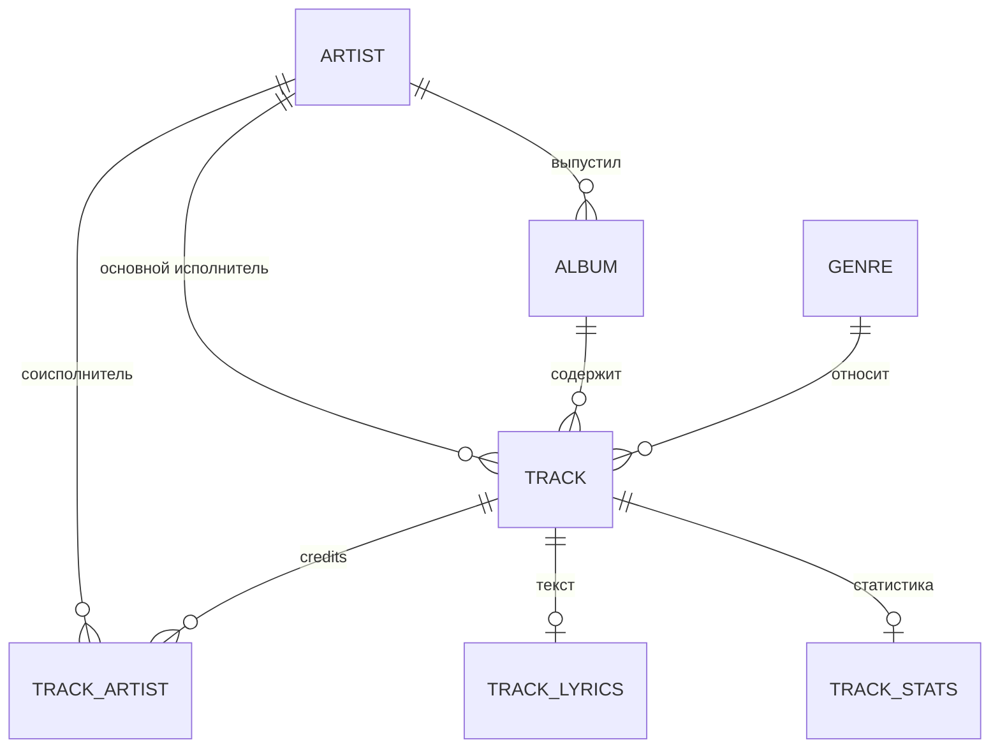
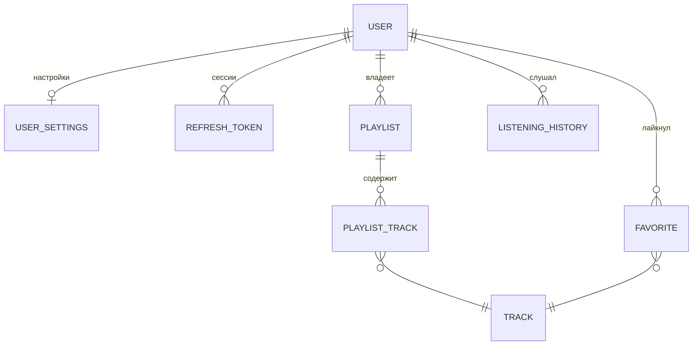
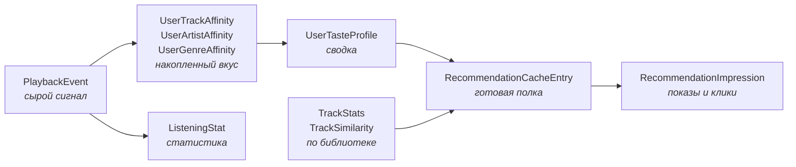

# 04. Модель предметной области

Все сущности — в [`backend/src/MusicStreaming.Domain/Entities/`](../../backend/src/MusicStreaming.Domain/Entities/).
Весь проект Domain — около 1 100 строк, его реально прочитать целиком за полчаса, и это стоит сделать.

Общие свойства всех сущностей:

- **Идентификатор — `Guid.CreateVersion7()`.** UUIDv7 упорядочен по времени, поэтому вставка не
  фрагментирует индекс так, как случайный UUIDv4. См. [ADR-0008](adr/0008-uuid-v7-identifiers.md).
- **Никакого поведения.** Ни базового класса, ни агрегатов, ни доменных событий. Свойства и изредка
  вычисляемое свойство вроде `RefreshToken.IsActive(now)`. Логика — в сервисах Application.
- **`CreatedAt` — `DateTimeOffset.UtcNow`.** Всё время в базе хранится в UTC; в местное оно
  переводится только при построении статистики, и только силами Postgres.

## Каталог



| Сущность | Ключевое |
|---|---|
| `Artist` | `NormalizedName` **уникален** — именно поэтому одного исполнителя нельзя завести дважды |
| `Album` | Уникальна пара `(ArtistId, NormalizedTitle)`: «Greatest Hits» может быть у многих, но у одного исполнителя — один |
| `Genre` | `NormalizedName` уникален |
| `Track` | `ContentHash` **уникален** (тот же файл нельзя загрузить дважды) и `FilePath` уникален |
| `TrackArtist` | Составной ключ `(TrackId, ArtistId)`, поле `Position` хранит порядок в титрах |

### Правила удаления

Это первое, обо что спотыкаются при работе с каталогом. Настроены в
[`Configurations/LibraryConfiguration.cs`](../../backend/src/MusicStreaming.Infrastructure/Persistence/Configurations/LibraryConfiguration.cs):

| Связь | Поведение | Смысл |
|---|---|---|
| `Track.Artist` | `Restrict` | Исполнителя нельзя удалить, пока у него есть треки |
| `Album.Artist` | `Restrict` | То же для альбомов |
| `TrackArtist.Artist` | `Restrict` | И для соисполнителей |
| `Track.Album` | `SetNull` | Удалили альбом — треки остались, просто «без альбома» |
| `Track.Genre` | `SetNull` | То же для жанра |
| `TrackArtist.Track` | `Cascade` | Титры не переживают трек |
| `PlaylistTrack.*`, `Favorite.*`, `ListeningHistoryEntry.*` | `Cascade` | Удаление трека или пользователя вычищает ссылки на него |

Комбинация `Restrict` на исполнителя и `Cascade` на его связи означает: чтобы удалить исполнителя,
сначала нужно удалить его треки. Ровно так и работает удаление трека в
`TrackEditService` — оно удаляет трек, а затем подчищает исполнителя, альбом и жанр, если они
осиротели. Проверено в
[`tests/…/TrackDeleteTests.cs`](../../backend/tests/MusicStreaming.IntegrationTests/TrackDeleteTests.cs).

### Нормализованные колонки

У `Artist`, `Album`, `Genre` и `Track` рядом с человекочитаемым названием лежит `Normalized*`.
Заполняется через
[`Normalize.Key()`](../../backend/src/MusicStreaming.Domain/Common/Normalize.cs) — обрезка, нижний
регистр, схлопывание пробелов:

```csharp
public static string Key(string value) =>
    string.Join(' ', (value ?? string.Empty).Trim().ToLowerInvariant()
        .Split(' ', StringSplitOptions.RemoveEmptyEntries | StringSplitOptions.TrimEntries));
```

Восемь строк, но именно на них держится вся дедупликация: уникальные индексы стоят на
нормализованных колонках, а не на исходных. `«The   Beatles»`, `«the beatles»` и `«The Beatles »` —
один и тот же исполнитель. Функция живёт в Domain, потому что от неё зависит смысл данных в базе:
измените её — и часть существующих строк перестанет находиться по своему же ключу.

Рядом — [`ArtistNames.Split()`](../../backend/src/MusicStreaming.Domain/Common/ArtistNames.cs):
разбирает тег `«A feat. B / C x D»` на отдельные имена. Разделители — `;`, `/`, `,`, `feat`/`ft`/
`featuring`, `vs`/`versus`, `x`/`×`. Максимум 12 имён (`MaxCredits`): ограничение защищает от
мусорных тегов, где в поле исполнителя записан весь трек-лист.

## Пользователи и их данные



| Сущность | Ключевое |
|---|---|
| `User` | `IsAdmin` и `IsActive`. Пользователи **не удаляются**, а деактивируются — [ADR-0016](adr/0016-soft-delete-users.md) |
| `UserSettings` | Отдельная таблица 1:1. Качество, автоплей, экономия трафика, часовой пояс IANA |
| `RefreshToken` | Хранится **хеш** токена, не сам токен. `RevokedAt` вместо удаления — на этом держится обнаружение повторного использования |
| `Playlist` | `IsPublic` открывает плейлист на чтение всем; менять по-прежнему может только владелец |
| `PlaylistTrack` | Уникальный индекс `(PlaylistId, TrackId)` — см. ниже |
| `Favorite` | Составной ключ `(UserId, TrackId)`, отдельного `Id` нет и не нужно |

Два места здесь стоит разобрать отдельно.

**`UserSettings` — почему не колонки в `User`.** `User` целиком грузится при каждом входе и в каждой
админской операции; настройки нужны только плееру и статистике. Плюс часовой пояс обязан быть на
сервере, а не в `localStorage`: без него нельзя посчитать «сколько я слушал во вторник».
Вычисляемое `EffectiveQuality` реализует правило «экономия трафика перебивает выбранный профиль, не
затирая его».

**Уникальный индекс на `playlist_tracks`.** Раньше позиция считалась запросом `MAX(position) + 1`, и
два одновременных добавления — двойной клик или два устройства — читали одно значение и вставляли
обе строки. Ответить на вопрос «уже есть?» без гонки способна только база. Индекс добавлен
миграцией `20260817074113_UniquePlaylistTrack`, которая сначала чистит существующие дубли и
перенумеровывает позиции. Комментарий — в
[`UserContentConfiguration.cs`](../../backend/src/MusicStreaming.Infrastructure/Persistence/Configurations/UserContentConfiguration.cs).

## Три хранилища прослушиваний

Самое неочевидное место модели. Три таблицы выглядят дублирующими друг друга, но ни одна не заменяет
остальные:

| | `ListeningHistoryEntry` | `PlaybackEvent` | `ListeningStat` |
|---|---|---|---|
| **Для чего** | Полка «недавно слушал» | Движок рекомендаций | Статистика пользователя |
| **Запись** | Перезаписывается в пределах 30 минут | Только добавление, никогда не меняется | Инкремент по часу |
| **Время жизни** | Последняя 1000 записей на пользователя | `Recommendations:EventRetentionDays` (180 дней) | Навсегда |
| **Гранулярность** | Событие с позицией | Событие с секундами, сессией, источником | Час × трек × пользователь |

Почему нельзя обойтись одной:

- История **перезаписывает** свою строку и подрезается — по ней невозможно посчитать ни повторы, ни
  прошлый год.
- События знают настоящие секунды, но **чистятся по сроку хранения** — годовая статистика по ним
  недостижима.
- Affinity живёт вечно, но **не помнит, когда** слушали, — только накопленный вес.

Час как единица `ListeningStat` выбран потому, что это самая крупная гранулярность, из которой ещё
выводится «активность по часам суток», и достаточно мелкая, чтобы `AT TIME ZONE` развернул её в
местные сутки любого пояса. Полное обоснование — [ADR-0019](adr/0019-three-listening-stores.md),
исходный комментарий — в
[`ListeningStat.cs`](../../backend/src/MusicStreaming.Domain/Entities/ListeningStat.cs).

## Подобласть рекомендаций

[`Entities/Recommendations/`](../../backend/src/MusicStreaming.Domain/Entities/Recommendations/) —
данные движка. Здесь достаточно понимать роли; механика — в [`08-recommendations.md`](08-recommendations.md).



| Сущность | Роль |
|---|---|
| `PlaybackEvent` | Сырой сигнал. `Sequence` — счётчик базы, служит watermark для возобновляемого роллапа |
| `UserTrackAffinity` / `UserArtistAffinity` / `UserGenreAffinity` | Накопленный вкус с экспоненциальным затуханием. Общая часть вынесена в `IDecayingAffinity` |
| `UserTasteProfile` | Сводка: топ-20 исполнителей, топ-10 жанров, зрелость, `EventsWatermark` |
| `TrackStats` | Популярность и качество трека в масштабе библиотеки — априор для холодного старта |
| `TrackSimilarity` | Предрассчитанный сосед. Хранится **в обе стороны**, чтобы выборка была одним обращением к индексу |
| `RecommendationCacheEntry` | Готовая полка. Хранит **только идентификаторы** — [ADR-0021](adr/0021-cache-stores-ids-only.md) |
| `RecommendationImpression` | Показы и клики, для расчёта CTR |
| `RecommendationRun` | Журнал проходов генерации, читается админской диагностикой |

Два решения, которые определяют всю подсистему:

**`Sequence`, а не `OccurredAt`.** `OccurredAt` — это часы клиента. Заснувшая вкладка присылает пачку
событий с временем более старым, чем уже обработанные, и роллап их пропустил бы. Серверный счётчик
монотонен по построению — но только потому, что писатель ровно один
([ADR-0022](adr/0022-droppable-telemetry.md), [`08-recommendations.md`](08-recommendations.md)).

**Инкрементальное затухание.** `DecayedWeight` + `DecayAnchor` дают формулу
`weight = weight · 2^(−(t − anchor)/halfLife) + w`, где `anchor := t`. Значение в любой момент —
`weight · 2^(−(now − anchor)/halfLife)`. Роллап стоит O(1) на событие, а сырые события можно удалять
по сроку хранения, не теряя накопленный вкус. См. [ADR-0020](adr/0020-incremental-decay.md).

## Интеграции

[`Entities/Integrations/`](../../backend/src/MusicStreaming.Domain/Entities/Integrations/):

- `LastfmAccount` — привязка учётной записи. `SessionKey` хранится **зашифрованным**.
- `OutboundJob` — универсальная задача на исходящую доставку. Таблица ничего не знает про Last.fm:
  есть `Kind`, есть непрозрачный jsonb-`Payload` и `DedupeKey`. См.
  [ADR-0023](adr/0023-generic-outbox.md) и [`09-integrations.md`](09-integrations.md).

## Перечисления — append-only

Все перечисления проекта одновременно:
- **хранятся в базе числами** — менять числовые значения нельзя;
- **сериализуются в JSON строками** — менять имена тоже нельзя.

Отсюда правило: значения только **дописываются в конец**, никогда не переименовываются, не
переупорядочиваются и не удаляются.

| Перечисление | Где | Значения |
|---|---|---|
| `AudioQuality` | `Domain/Common/AudioQuality.cs` | `Low`, `Normal`, `High`, `Original` — намеренно как лестница, чтобы сравнение имело смысл |
| `PlaybackEventType` | `Entities/Recommendations/PlaybackEnums.cs` | 15 видов сигналов |
| `PlaybackSource` | там же | 12 источников запуска |
| `ProfileMaturity` | там же | `Cold` / `Warm` / `Mature` |
| `RecommendationTrigger`, `RecommendationRunStatus`, `RecommendedItemKind` | там же | Служебные |
| `LyricsSource` | `Entities/TrackLyrics.cs` | `Embedded` / `Manual` |
| `OutboundJobKind`, `OutboundJobState` | `Entities/Integrations/OutboundJob.cs` | Вид и состояние исходящей задачи |

`AudioQuality.Original` заслуживает отдельного внимания: это не «самое лучшее качество», а «исходный
файл как есть». Он может оказаться ALAC, которого не знает ни один браузер, — и тогда перекодированные
ступени становятся **единственным способом услышать трек**, а не способом сэкономить трафик. Этим же
объясняется отдельная от `MimeType` колонка `Track.Codec`: ALAC и AAC оба лежат в `audio/mp4`, и
различить их больше нечем.

## Значения внутри jsonb

Три типа не имеют своих таблиц и живут внутри колонок `jsonb`:

| Тип | Где лежит |
|---|---|
| `LyricLine(int At, string Text)` | `TrackLyrics.Synced` |
| `TasteEntry(Guid Id, string Name, double Score)` | `UserTasteProfile.TopArtists`, `TopGenres` |
| `CachedRecommendation(...)` | `RecommendationCacheEntry.Payload` |

Все три — `record`, и это не стилистика: EF сравнивает такие коллекции через `SequenceEqual`, что
работает корректно только при структурном равенстве. Подробности — [`05-persistence.md`](05-persistence.md)
и [ADR-0009](adr/0009-jsonb-for-value-objects.md).

## Куда дальше

[`05-persistence.md`](05-persistence.md) — как всё это ложится в Postgres.
