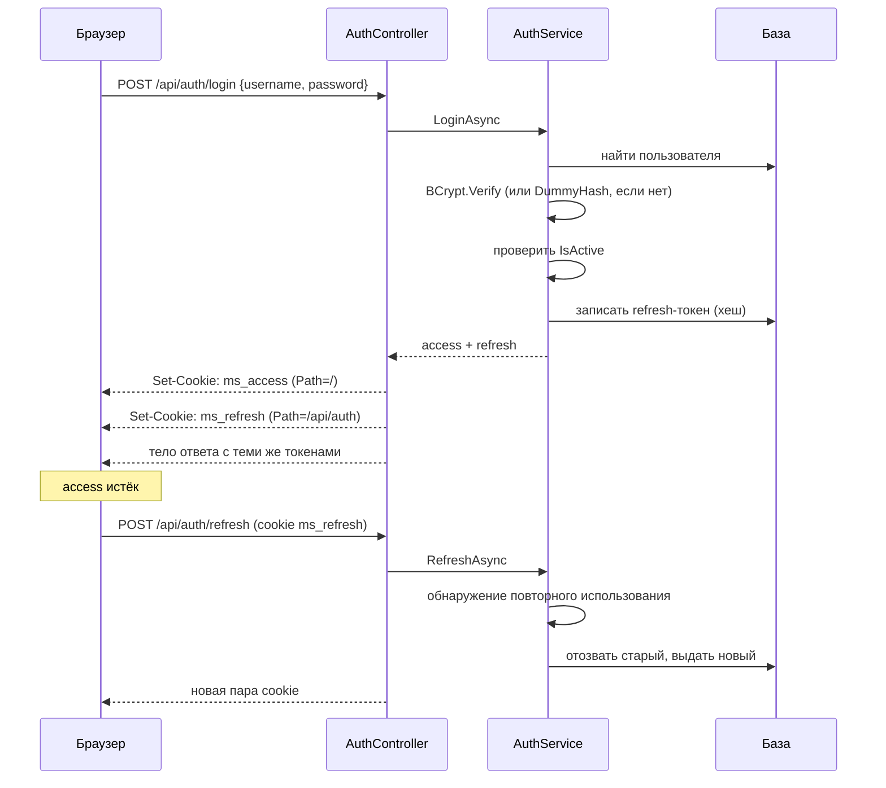

# 06. Безопасность

## Общая картина



## Токены

Выпускает
[`Infrastructure/Security/JwtTokenService.cs`](../../backend/src/MusicStreaming.Infrastructure/Security/JwtTokenService.cs).

| | Access-токен | Refresh-токен |
|---|---|---|
| Формат | JWT, HS256 | Случайная строка |
| Хранение на сервере | не хранится | **хеш** в `refresh_tokens` |
| Срок | `Jwt:AccessTokenMinutes` | `Jwt:RefreshTokenDays` (30) |
| Cookie | `ms_access`, `Path=/` | `ms_refresh`, `Path=/api/auth` |
| Отзыв | **невозможен досрочно** | `RevokedAt` |

Claims — `sub` (идентификатор), `username`, `role`. Имена собраны в
[`AuthorizationNames.cs`](../../backend/src/MusicStreaming.Application/Abstractions/AuthorizationNames.cs).

Настройка проверки — в
[`Startup/AuthenticationSetup.cs`](../../backend/src/MusicStreaming.Api/Startup/AuthenticationSetup.cs):

- **`MapInboundClaims = false`** — отключает историческое переименование claims в длинные URI-подобные
  имена. Без этого `sub` превратился бы в `http://schemas.xmlsoap.org/...`, и `AppClaims.UserId` не
  совпал бы ни с чем.
- **`ClockSkew = 30 секунд`** вместо стандартных пяти минут. Значение по умолчанию слишком щедро для
  токена, живущего минуты.
- **`NameClaimType = "username"`, `RoleClaimType = "role"`** — чтобы `User.Identity.Name` и
  `RequireRole` работали с нашими claims. Первое, кстати, использует ограничение частоты для
  политики `events`.

## Токен из cookie

Ключевой обработчик:

```csharp
options.Events = new JwtBearerEvents
{
    OnMessageReceived = context =>
    {
        if (string.IsNullOrEmpty(context.Token) &&
            context.Request.Cookies.TryGetValue(AuthCookies.AccessTokenCookie, out var cookieToken))
        {
            context.Token = cookieToken;
        }
        return Task.CompletedTask;
    },
};
```

Заголовок имеет приоритет; cookie — запасной путь. Он нужен потому, что `<audio src="...">` и
`` не позволяют задать заголовок. Полное обоснование — [ADR-0013](adr/0013-jwt-in-cookie.md).

Политика cookie — [`Api/Auth/AuthCookies.cs`](../../backend/src/MusicStreaming.Api/Auth/AuthCookies.cs):

- `HttpOnly = true` — JavaScript токен не видит;
- `SameSite = Lax` — защита от CSRF, межсайтовых сценариев у приложения нет;
- `Secure` — всегда, **кроме** Development поверх http (иначе браузер не вернул бы cookie на
  `http://localhost`, и вход выглядел бы как молча не сработавший);
- refresh-cookie ограничена путём `/api/auth`, поэтому не отправляется с обычными запросами.

## Авторизация

**Политика по умолчанию требует аутентификации:**

```csharp
services.AddAuthorizationBuilder()
    .SetFallbackPolicy(new AuthorizationPolicyBuilder().RequireAuthenticatedUser().Build())
    .AddPolicy(AppPolicies.Admin, policy => policy
        .RequireAuthenticatedUser()
        .RequireRole(AppRoles.Admin));
```

Любая новая ручка закрыта, пока на неё явно не повесили `[AllowAnonymous]`. Список анонимных мест и
обоснование — [ADR-0015](adr/0015-secure-by-default.md).

Роль одна — `Admin`. Ею закрыты: загрузка и правка треков, массовое удаление, правка исполнителей и
их изображений, ручная правка текста песен, управление пользователями, диагностика рекомендаций.

**Роль зашита в access-токен.** Отсюда: снятие прав администратора вступит в силу только после
истечения текущего токена. Мгновенно закрыть доступ можно лишь деактивацией пользователя — она
отзывает refresh-токены, и продлить сессию не выйдет.

Личность внутри сервисов доступна через `ICurrentUser` — только `Id` и `IsAuthenticated`. Сервисы не
знают ни про `HttpContext`, ни про claims.

## Пароли

BCrypt, [`Security/BCryptPasswordHasher.cs`](../../backend/src/MusicStreaming.Infrastructure/Security/BCryptPasswordHasher.cs).
Правила — `Common/PasswordPolicy.cs`, минимум 8 символов.

Два приёма в
[`AuthService.LoginAsync`](../../backend/src/MusicStreaming.Application/Services/AuthService.cs#L16-L41),
которые стоит узнать:

**Сверка с `DummyHash`, когда пользователя нет.**

```csharp
var hashToCheck = user?.PasswordHash ?? DummyHash;
var passwordOk = passwordHasher.Verify(request.Password ?? string.Empty, hashToCheck);
```

BCrypt намеренно медленный. Если пропускать проверку для несуществующего имени, ответ приходил бы
заметно быстрее — и по времени можно было бы перебрать список существующих логинов. Сверка с
фиктивным хешем выравнивает время.

**Проверка `IsActive` — после пароля.** Иначе ответ «учётная запись деактивирована» сообщал бы о
существовании пользователя любому, кто угадал имя. Оба ответа — `403` с разным текстом, но получить
второй можно только зная пароль.

## Ротация refresh-токенов

Самый тонкий код в проекте —
[`AuthService.RefreshAsync`](../../backend/src/MusicStreaming.Application/Services/AuthService.cs#L43-L107).
Разбор по шагам — в [ADR-0014](adr/0014-refresh-token-rotation.md); здесь коротко о сути.

Каждое обновление отзывает предъявленный токен и выдаёт новый. Предъявление **отозванного** токена
имеет два объяснения: гонка двух вкладок или кража. Различаются они так:

```csharp
var sessionLivesOn = await db.RefreshTokens.AnyAsync(
    t => t.UserId == stored.UserId && t.RevokedAt == null && t.ExpiresAt > now, ct);

if (!sessionLivesOn || now - revokedAt > ReuseGrace)  // ReuseGrace = 20 секунд
{
    // гасим все токены пользователя
}
```

Логика: после **ротации** сессия продолжает жить — где-то есть действующий токен. После
**деактивации, смены пароля или реакции на кражу** не остаётся ни одного. Поэтому «живой токен есть
**и** прошло меньше 20 секунд» — точное описание гонки, а проверка одного лишь возраста отменяла бы
защиту на длину окна.

При обнаружении отзываются **все** активные токены пользователя: кто настоящий владелец — неизвестно,
поэтому войти заново сможет тот, у кого есть пароль.

## Ограничение частоты

[`Startup/RequestPipelineSetup.cs`](../../backend/src/MusicStreaming.Api/Startup/RequestPipelineSetup.cs):

| Политика | Где | Лимит | Разделение | Почему так |
|---|---|---|---|---|
| `login` | `POST /api/auth/login` | `Security:LoginAttemptsPerMinute`, по умолчанию 10 | по IP | Атакующий ещё не представился |
| `events` | `POST /api/events` | 120/мин | **по имени пользователя** | За домашним NAT сидит вся семья, делить общий бюджет неправильно |

Лимит входов вынесен в настройку именно потому, что за общим выходом в интернет — из-под NAT или
VPN — под одним адресом живёт несколько человек, и десяти попыток на всех может не хватить.

Стоит `UseRateLimiter` **до** аутентификации: перебор должен упираться в лимит, а не в BCrypt.

## Заголовки прокси

`UseForwardedHeaders` идёт первым в конвейере и настроен строго:

```csharp
options.ForwardLimit = 1;
options.KnownIPNetworks.Clear();
options.KnownProxies.Clear();
```

Доверяются только сети из `ForwardedHeaders:KnownNetworks` (по умолчанию — RFC1918 и loopback), и
только **один** переход. Без этого клиент мог бы подделать `X-Forwarded-For` и обойти ограничение
входов по IP.

## Валидация ключа подписи

При старте, в
[`Infrastructure/DependencyInjection.cs:30-43`](../../backend/src/MusicStreaming.Infrastructure/DependencyInjection.cs#L30-L43):

- ключ задан;
- ключ не короче **32 байт**;
- ключ **не входит в список известных утёкших**.

```csharp
private static readonly HashSet<string> LeakedSigningKeys = new(StringComparer.Ordinal)
{
    "2QAkr9k7Rr8J7YtZx/pPxuf1dbIRCB3rz2/lmJiHrR1chcApv8JZpPp2D7jT8ob+",
};
```

Это реальный ключ, который однажды попал в публичный репозиторий. Проверка нужна потому, что при
копировании чужого `docker-compose.yml` такое значение легко унаследовать, не задумываясь.

Все три проверки — `ValidateOnStart()`: приложение **не запустится**, а не упадёт на первом входе.

## Шифрование чужих секретов

Ключ сессии Last.fm бессрочен, и его утечка означает постоянный доступ к чужому профилю. Поэтому он
хранится зашифрованным через порт `ISecretProtector` → адаптер
[`DataProtectionSecretProtector`](../../backend/src/MusicStreaming.Infrastructure/Security/DataProtectionSecretProtector.cs)
(ASP.NET Data Protection).

Ключи шифрования лежат в `{Storage:RootPath}/.dataprotection`
([`LimitsSetup.cs:49-52`](../../backend/src/MusicStreaming.Api/Startup/LimitsSetup.cs#L49-L52)).

> **Важно для эксплуатации:** этот каталог входит в том хранилища. Потеряете его — все привязки
> Last.fm перестанут работать и потребуют повторного подключения. Включайте его в бэкап.

## Защита файловых путей

Все пути проходят через `ResolveWithinRoot` в `FileSystemMusicStorage`: отвергаются абсолютные пути,
двоеточия и всё, что выводит за пределы корня. Нарушение — `UnauthorizedAccessException`, которое
middleware превращает в 403 и логирует как `Error`. Подробности — [`07-media-pipeline.md`](07-media-pipeline.md).

## Заголовки безопасности

Ставит не приложение, а Caddy ([`deploy/Caddyfile`](../../deploy/Caddyfile)): `Content-Security-Policy`,
`X-Content-Type-Options: nosniff`, `X-Frame-Options: DENY`, `Referrer-Policy`,
`Strict-Transport-Security`, `Cross-Origin-Opener-Policy`, а также `X-Robots-Tag: noindex, nofollow`.
Заголовок `Server` удаляется.

В CSP оставлен `'unsafe-inline'` для скриптов — Next.js поднимает приложение встроенным блоком, и без
nonce на каждый ответ его не убрать. А вот `'unsafe-eval'` намеренно **не** разрешён.

## Куда дальше

[`07-media-pipeline.md`](07-media-pipeline.md) — путь аудиофайла от загрузки до колонок.
