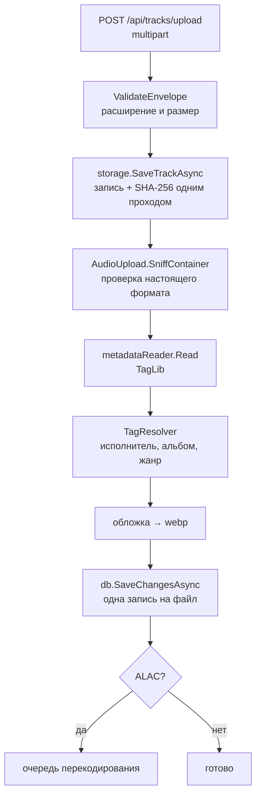

# 07. Путь медиафайла

Самая длинная цепочка в приложении. Здесь же — почти вся работа с внешним миром: диск, ffmpeg,
разбор тегов, обработка изображений.

## Загрузка



Точка входа —
[`TrackUploadService`](../../backend/src/MusicStreaming.Application/Services/TrackUploadService.cs).

### Проверка формата в два шага

Сначала — по имени файла (`AudioUpload.For`), потом — **по содержимому**:

```csharp
if (AudioUpload.SniffContainer(absolutePath) is { } actual && actual != format.Extension)
    throw new ValidationException($"The file is not a {format.Label} file despite its name.");
```

А вот заявленный браузером `Content-Type` **не проверяется вовсе**, и это осознанно: он подделывается
тривиально, а для одного и того же файла разные браузеры присылают то `audio/x-flac`, то `video/mp4`,
то пустую строку. Отказ по нему был бы видимой человеку ошибкой и ни от чего бы не защищал.
Настоящий фильтр — разбор TagLib, который ждёт файл дальше по пути.

### Хеш считается на лету

`SaveTrackAsync` пишет файл и одновременно считает SHA-256 одним проходом:

```csharp
using var hasher = IncrementalHash.CreateHash(HashAlgorithmName.SHA256);
while (true)
{
    var read = await content.ReadAsync(...);
    if (read == 0) break;
    size += read;
    if (size > maxBytes) throw new UploadTooLargeException(maxBytes);
    hasher.AppendData(buffer, 0, read);
    await target.WriteAsync(...);
}
```

Файл не читается дважды, а проверка размера идёт по мере поступления байт. Полученный хеш используется
трижды: уникальность трека, ключ кэша перекодирования, ETag.

### Три механизма отката

Загрузка пакета файлов не должна прерываться на первом неудачном. Отсюда три разных отката, и путать
их нельзя:

**1. Файл на диске.** `catch` в `UploadSingleAsync` удаляет записанный файл.

**2. Обложки.** Обложка пишется на диск **раньше**, чем альбом попадает в базу. У неудавшегося файла
строки альбома не появится вовсе, и оставленный файл потом не подберёт никто: плановая уборка ходит
по обложкам существующих альбомов. Поэтому пути записанных обложек копятся в списке `_coversWritten`
и удаляются в `catch`. Список, а не одно поле — потому что повторные попытки заводят новый альбом с
новым идентификатором.

**3. Несохранённые сущности.** Самое неочевидное:

```csharp
private void DiscardPending()
{
    db.ChangeTracker.Clear();
    tags.Forget();
}
```

Каждый файл сохраняется **одним разом в конце**, поэтому незаписанным остаётся ровно то, что завёл
упавший. Без сброса его исполнитель, альбом и трек уехали бы в базу вместе со **следующим** файлом —
причём трек ссылался бы на аудиофайл, который к этому моменту уже удалён.

Отслеживание сбрасывается **целиком**, а не по одной записи: отцепить исполнителя, пока рядом висит
его альбом, нельзя — EF считает разорванной обязательную связь и бросает исключение прямо посреди
уборки.

`tags.Forget()` обязателен в той же строке: память `TagResolver` указывает на те же — теперь
отцепленные — сущности, и вернуть их значило бы сослаться на строку, которой никогда не будет.

Ради этого `ChangeTracker` и торчит наружу из `IApplicationDbContext` — см.
[ADR-0004](adr/0004-efcore-in-application-layer.md).

### TagResolver и гонка за общими сущностями

[`TagResolver`](../../backend/src/MusicStreaming.Application/Services/TagResolver.cs) — `Scoped`,
то есть его память живёт **ровно один запрос**. Он нужен по двум причинам, и вторая важнее первой:

1. *Скорость.* Один файл спрашивает про исполнителя дважды: как про исполнителя трека и как про
   исполнителя альбома.
2. *Корректность.* Запрос **не видит** сущности, которые этот же запрос создал, но ещё не сохранил.
   Без памяти второй вопрос завёл бы второго исполнителя с тем же именем — и упёрся бы в уникальный
   индекс по `normalized_name`.

Но исполнители общие на всю библиотеку, а память резолвера — нет. Два файла одного альбома,
приехавшие одновременно, оба не находят исполнителя, оба его заводят, и второй упирается в уникальный
индекс. Ответ — повтор:

```csharp
catch (DbUpdateException) when (attempt < TagConflictAttempts)  // 4 попытки
{
    DiscardPending();
    logger.LogDebug("Retrying {FileName} after losing a race for its artist, album or genre …");
}
```

Проигравшему достаточно переспросить: строки, которой он не нашёл, теперь есть. В повтор входит и
проверка на дубликат — одновременно приехавшие одинаковые файлы оба её проходят, и проигравшему
честнее ответить «уже в библиотеке», чем «не удалось обработать».

### Предварительная проверка

`POST /api/tracks/upload/check` (`UploadProbeService`) позволяет клиенту прислать хеши и теги **до**
отправки файлов и узнать, что из этого уже в библиотеке. Совпавшее не приходится загружать вовсе.

## Хранилище

Порт [`IMusicStorage`](../../backend/src/MusicStreaming.Application/Abstractions/IMusicStorage.cs) →
адаптер `FileSystemMusicStorage`. Обоснование выбора файловой системы — [ADR-0017](adr/0017-filesystem-instead-of-s3.md).

```
{Storage:RootPath}/
├── music/{xx}/{yy}/{uuid}{ext}
├── covers/
├── artists/
├── playlists/
├── transcodes/
└── .dataprotection/        ← ключи шифрования, включать в бэкап!
```

Путь трека строится так:

```csharp
var id = Guid.CreateVersion7().ToString("N");
var relativePath = $"{MusicDirectory}/{id[^2..]}/{id[^4..^2]}/{id}{extension}";
```

Разброс — по **последним** байтам GUID. У UUIDv7 старшие биты — метка времени (то есть почти
одинаковы у соседних файлов), а младшие случайны. Взяв последние, получаем равномерное заполнение
256 × 256 каталогов; взяв первые, сложили бы всё загруженное за день в один каталог.

### Защита пути

Всё проходит через `ResolveWithinRoot`, который отвергает абсолютные пути, двоеточия и любой выход за
корень, бросая `UnauthorizedAccessException` → 403 с записью в лог уровня `Error`. Плюс отдельная
проверка `IsSafeExtension` — расширение единственная часть имени, пришедшая снаружи. Дублирование
намеренное.

## Перекодирование

[`FfmpegAudioTranscoder`](../../backend/src/MusicStreaming.Infrastructure/Audio/FfmpegAudioTranscoder.cs)
запускает внешний `ffmpeg`:

```
-nostdin -hide_banner -loglevel error
-i <источник> -vn -map_metadata -1 -threads 1
-c:a libopus -b:a <N>k -vbr on -application audio
-f ogg -y <временный файл>
```

| Флаг | Зачем |
|---|---|
| `-map_metadata -1` | Теги не переносятся: файл служебный, метаданные клиент берёт из API |
| `-threads 1` | Одно перекодирование не должно занять все ядра сервера, на котором идёт воспроизведение |
| `-vn` | Отбросить встроенную обложку |
| `-vbr on` | Переменный битрейт — лучше качество при том же размере |

**Атомарная запись:** результат пишется во временный `.part` и переименовывается через `File.Move`.
Прерванное перекодирование не оставит битый файл, который потом отдадут слушателю.

**ffmpeg может отсутствовать.** Наличие проверяется один раз через `ffmpeg -version` и кэшируется в
`Lazy<bool>`. Если бинарника нет, `ConfigController` просто не объявляет клиенту ступени качества,
кроме `Original`. Приложение остаётся работоспособным.

Битрейты — `TranscodeOptions.BitrateFor`: `Low` = 64, `Normal` = 128, `High` = 192 кбит/с,
`Original` → `null` (не перекодировать).

## Отдача аудио

[`StreamingService.OpenTrackAsync`](../../backend/src/MusicStreaming.Application/Services/StreamingService.cs#L45-L103):

1. Определить желаемую ступень: параметр запроса или `settings.EffectiveQuality`.
2. Если ступень не `Original` и ffmpeg доступен — искать в кэше `transcodes/`.
3. **Есть** → отдать, ETag `"{hash}-{quality}"`.
4. **Нет** → поставить задачу в `TranscodeQueue` и **отдать оригинал прямо сейчас**.

Слушатель никогда не ждёт ffmpeg. Обоснование и цена — [ADR-0018](adr/0018-lazy-transcoding.md).

Одно исключение: **ALAC перекодируется заранее**, при загрузке.

```csharp
private void PrepareUnplayableOriginal(Track track)
{
    if (track.Codec is not "alac") return;
    transcodeQueue.TryEnqueue(new TranscodeRequest(track.ContentHash, track.FilePath, AudioQuality.Normal));
}
```

Причина: ALAC не понимают ни Chrome, ни Firefox. Плеер, упёршийся в такой исходник, попросит экономную
ступень — и получит в ответ снова исходник, потому что ступени ещё нет. Ждать ffmpeg внутри запроса он
не умеет, значит ступень должна появиться **до** первого включения.

Контроллер ставит `enableRangeProcessing: true` и `Cache-Control: private, max-age=604800`. Ключ кэша
— хеш **содержимого**, поэтому правка тегов не инвалидирует перекодированную версию: звук не менялся.

## Изображения

`IImageProcessor` → `ImageSharpImageProcessor`. Все изображения приводятся к квадрату и
перекодируются в **webp** в двух размерах
([`CoverVariants.cs`](../../backend/src/MusicStreaming.Application/Common/CoverVariants.cs)):

| Вариант | Сторона | Где используется |
|---|---|---|
| `Full` | 640 px | Страница альбома, полноэкранный плеер |
| `Thumb` | 256 px | Списки, полки |

Запрашивается через `?size=thumb`. Если варианта нет (обложка загружена до появления размеров),
`StreamingService` отдаёт полную версию — проверка `ResolveExisting` перед выбором пути.

Обложки берутся из тегов при загрузке; альбом получает обложку от **первого** трека, у которого она
есть. Если ImageSharp не справился, альбом остаётся без обложки, а загрузка не падает — предупреждение
в лог.

`CoverBackfillService` — разовый фоновый процесс: переупаковывает обложки, сохранённые до перехода на
webp и на два размера.

Заголовок — `private, max-age=86400, stale-while-revalidate=604800`, ETag построен из времени
изменения файла и его длины (`MediaResults.ImageFile`).

## Скачивание

`GET /api/tracks/{id}/download` отдаёт **всегда `Original`** с `Cache-Control: private, no-store` и
именем файла из `DownloadFileName.For(artist, title, extension)` — он же чистит имя от символов,
недопустимых в файловых системах.

## Куда дальше

[`08-recommendations.md`](08-recommendations.md) — самая большая подсистема.
