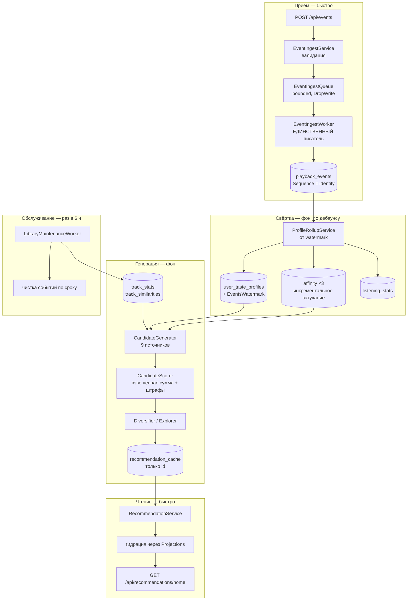

# 08. Рекомендации

Самая большая подсистема. Читайте её последней: она опирается на модель данных
([`04`](04-domain-model.md)), хранение ([`05`](05-persistence.md)), фоновые процессы
([`02`](02-architecture.md)) и метрики ([`10`](10-observability.md)).

Хорошая новость: **это самая подробно прокомментированная часть кода в проекте.** Ниже — карта,
которая помогает понять, в каком порядке читать; сами объяснения в основном уже в исходниках.

## Главный принцип

**Всё дорогое случается в фоне.** Путь чтения — это выборка готовой полки по первичному ключу плюс
один запрос наполнения. К моменту прихода запроса ответ уже лежит строкой в таблице.



## Этап 1. Приём событий

**Контроллер:** `EventsController`, политика частоты `events` (120/мин **на пользователя**).
**Сервис:** `EventIngestService` — валидирует и зажимает `OccurredAt` (часы клиента могут быть сбиты).
**Очередь:** [`EventIngestQueue`](../../backend/src/MusicStreaming.Application/Recommendations/EventIngestQueue.cs)
— ограниченный канал на 8192 с `FullMode = DropWrite`.
**Писатель:** `EventIngestWorker`, батчами до 500.

Два решения определяют всё дальнейшее:

**Телеметрию можно терять.** Постановка в очередь не ждёт: переполнение отбрасывает событие и
увеличивает счётчик `playback_events_dropped_total`. Потерянный при всплеске скип стоит доли одного
профиля; остановленный конвейер запросов стоит сессии. См. [ADR-0022](adr/0022-droppable-telemetry.md).

**Писатель ровно один — и это условие корректности, а не оптимизация.** `PlaybackEvent.Sequence` —
счётчик базы, служащий отметкой возобновления. При двух писателях транзакция с меньшим `Sequence`
могла бы стать видимой после того, как роллап уже прошёл дальше, — и событие потерялось бы молча и
навсегда. Отсюда `SingleReader = true` и запрет на второй экземпляр приложения
([ADR-0027](adr/0027-single-instance-deployment.md)).

Почему не `OccurredAt`: это часы клиента, и заснувшая вкладка присылает пачку с временем более
старым, чем уже обработанные события.

## Этап 2. Свёртка профиля

[`ProfileRollupService`](../../backend/src/MusicStreaming.Application/Services/Recommendations/ProfileRollupService.cs).

**Возобновляемо и идемпотентно.** Каждый проход стартует от `EventsWatermark`, записанного в профиле,
и останавливается на самом свежем увиденном событии. Второй запуск ничего не меняет, а падение
посреди прохода стоит лишь незавершённого батча (`BatchSize = 2000`).

Именно идемпотентность делает безопасной последующую чистку сырых событий: память системы — это
строки аффинити, а не журнал событий.

Один проход обновляет:

| Что | Как |
|---|---|
| `user_track_affinities` | Инкрементальное экспоненциальное затухание, период полураспада 45 дней |
| `user_artist_affinities` | То же, 90 дней |
| `user_genre_affinities` | То же, 90 дней |
| `user_taste_profiles` | Топ-20 исполнителей, топ-10 жанров, зрелость, `YearCenter`/`YearSpread` |
| `listening_stats` | Часовая сводка — тот же проход, тот же watermark |
| `recommendation_impressions.ClickedAt` | Проставляется, когда приходит прослушивание с источником «рекомендация» |

Вес события задаёт
[`EventWeights`](../../backend/src/MusicStreaming.Application/Recommendations/Scoring/EventWeights.cs),
формулу затухания — `AffinityMath` и `RecencyDecay`. Все три — чистые функции с юнит-тестами.
Обоснование схемы затухания — [ADR-0020](adr/0020-incremental-decay.md).

**Зрелость профиля** (`ProfileMaturity`: `Cold` → `Warm` → `Mature`) переключается по числу
положительных сигналов на порогах `WarmThreshold` = 10 и `MatureThreshold` = 100 и определяет, какой
набор весов применяет ранжирование (`RankingWeights`).

## Этап 3. Генерация полок

[`CandidateGenerator`](../../backend/src/MusicStreaming.Application/Services/Recommendations/CandidateGenerator.cs)
→ [`CandidateScorer`](../../backend/src/MusicStreaming.Application/Recommendations/Scoring/CandidateScorer.cs)
→ `Diversifier` / `Explorer` →
[`ShelfGenerationService`](../../backend/src/MusicStreaming.Application/Services/Recommendations/ShelfGenerationService.cs).

### Подбор кандидатов

**Девять независимых источников.** Ключевая мысль сформулирована в комментарии к классу: хорошие
рекомендации — сначала задача **полноты**, и только потом точности. Ранкер способен выбрать лишь из
того, что ему дали. Источники приносят соседей только что сыгранного, ещё треки любимых
исполнителей, то, что слушают похожие слушатели, новое, популярное и вовсе ни разу не слышанное.

Три правила:
- каждый источник **ограничен по объёму** — ни один не вытеснит остальные;
- трек, найденный несколькими источниками, **сохраняет сильнейшее свидетельство от каждого**, а не
  появляется в пуле несколько раз;
- источники **не отфильтровывают уже прослушанное** — повторами занимается ранжирование через штрафы
  остывания, а фильтрация здесь сделала бы невыразимой полку «продолжить прослушивание».

Метаданные грузятся **один раз для объединённого пула**, чтобы свойства, общие всем кандидатам
(свежесть, охват жанров, новизна), считались в одном месте.

### Оценка

`CandidateScorer` работает в два намеренно разделённых этапа:

1. **Взвешенная сумма** — насколько кандидат подходит пользователю.
2. **Штрафы** — стоит ли показывать его *именно сейчас*: недавно играл, приелся, был показан и не
   нажат.

Весь контекст (`RankingContext`) загружается заранее, поэтому сам расчёт **не обращается к базе** и
тестируется напрямую. Это причина, по которой всё содержимое `Recommendations/Scoring/` покрыто
юнит-тестами, а не интеграционными.

### Разнообразие и исследование

- **`Diversifier`** — жадный отбор с параметром `DiversityLambda` (0.3) и потолками `MaxPerArtist` = 2,
  `MaxPerAlbum` = 2, `MaxPerGenre` = 4. Без него полка «для вас» состояла бы из одного альбома.
- **`Explorer`** — доля незнакомого: `ExplorationRatio` = 0.25, а для полки «Discover» —
  `DiscoveryExplorationRatio` = 0.6.

### Полки

Ключи — `ShelfKeys` в `ShelfGenerationService.cs`:

| Ключ | Содержание |
|---|---|
| `continueListening` | Продолжить начатое |
| `forYou` | Основная персональная |
| `similarTo:{trackId}` | Похожее на конкретный трек |
| `becauseYouListened:{artistId}` | От конкретного исполнителя |
| `discover` | Незнакомое |
| `genreMix:{genreId}` | Микс по жанру |
| `newReleases`, `popular` | Библиотечные, не персональные |
| `artistsForYou`, `albumsForYou` | Не треки, а исполнители и альбомы |

Полки с зерном (`Seeded`) отделены двоеточием, и `BaseOf` возвращает часть до него — именно её клиент
сопоставляет с заголовком. Таких полок не больше `MaxSeededShelves` = 2.

Полка короче `MinimumShelfSize` = 4 **не показывается**: ниже этого она выглядит сломанной.

## Этап 4. Чтение

[`RecommendationService`](../../backend/src/MusicStreaming.Application/Services/Recommendations/RecommendationService.cs).

Три уровня кэша, и у каждого своя роль:

| Уровень | Время | Зачем |
|---|---|---|
| `IMemoryCache` | 60 секунд | Поглотить всплеск запросов от одной загрузки страницы. **Не** второй ярус кэша |
| `recommendation_cache` | `CacheTtlHours` = 6 | Собственно результат генерации |
| HTTP | — | Обычные заголовки на изображениях и аудио |

**Кэшируются только идентификаторы.** Названия, наличие обложки и признак избранного читаются заново
на каждый запрос — поэтому переименование трека или новый лайк видны сразу, а не после следующего
прохода генерации. См. [ADR-0021](adr/0021-cache-stores-ids-only.md).

### Первый визит и семафор

У нового пользователя полок ещё нет, и они строятся **прямо в запросе** — это секунды. Кэш в памяти
заполняется только по окончании, поэтому второй запрос того же человека (обновлённая страница, вторая
вкладка) снова видел промах и запускал вторую генерацию. Обе доходили до записи, обе вставляли одни и
те же `(UserId, ShelfKey)`, и проигравшая падала на первичном ключе — человек получал **пустую
главную** ровно там, где всё и затевалось.

Отсюда:

```csharp
private static readonly ConcurrentDictionary<Guid, SemaphoreSlim> InlineBuilds = new();
```

Замок в памяти процесса, а не в базе: второй копии сервиса в этой поставке нет, а распределённая
блокировка стоила бы дороже самой задачи. Ещё одна причина ограничения
[ADR-0027](adr/0027-single-instance-deployment.md).

### Устаревшая полка отдаётся как есть

Просроченная полка **всё равно возвращается**, а пользователь ставится в очередь на пересчёт. Никто
не ждёт генерации.

Важное следствие: определение «устарела» на пути чтения и в `RecommendationWorker.ShelvesNeedRebuildAsync`
**обязано совпадать**. Если они разойдутся, читатели будут бесконечно ставить в очередь пересчёты,
которые воркер посчитает ненужными, и полки не обновятся никогда.

## Фоновые процессы

| Процесс | Периодичность | Что делает |
|---|---|---|
| `EventIngestWorker` | непрерывно | Единственный писатель событий, батчи до 500 |
| `RecommendationWorker` | по дебаунсу `RegenerationDebounceSeconds` = 60 | Роллап **и затем** генерация, для одного пользователя подряд |
| `LibraryMaintenanceWorker` | `SimilarityIntervalHours` = 6 | Популярность, похожесть, чистка событий |

`RecommendationWorker` делает роллап и генерацию **в таком порядке и подряд** — чтобы полка никогда
не строилась по профилю, отставшему на одну пачку.

Очередь пересчёта —
[`RecommendationRefreshQueue`](../../backend/src/MusicStreaming.Application/Recommendations/EventIngestQueue.cs):
**множество**, а не очередь, потому что единица работы — «этот пользователь устарел», а не «это
событие нужно обработать». Слушатель, пролистывающий альбом, помечает себя сорок раз и должен быть
пересчитан один раз.

Хранится момент **первой** пометки, поэтому дебаунс работает как ограничение частоты, а не как
ожидание тишины: тот, кто слушает непрерывно, всё равно пересчитывается с фиксированной
периодичностью, а не никогда.

При старте `RecommendationWorker` помечает всех пользователей — подхватывает то, что накопилось, пока
сервис не работал.

`LibraryMaintenanceWorker` отделён потому, что у него другой профиль затрат: один тяжёлый проход по
всей библиотеке раз в несколько часов, а не лёгкий проход на каждого активного слушателя. Стартовая
задержка у него удвоенная, чтобы первый проход не соперничал с миграциями и дозаполнением обложек.

## Похожесть треков

`SimilarityMaintenance` строит `track_similarities`, смешивая два сигнала:

- **`ContentScore`** — по метаданным: общий исполнитель, альбом, жанр, близкий год и длительность.
  Считается **всегда**, даже без совместных прослушиваний. Это то, что работает на новой библиотеке.
- **`CollabScore`** — по совстречаемости в сессиях и плейлистах, с усадкой к нулю при малом
  `Support`. Усадка обязательна: пара, встретившаяся один раз, не является свидетельством.

Порог включения коллаборативной части — `UserCfMinUsers` = 5 и `UserCfMinInteractions` = 30. На
личном сервере с двумя пользователями коллаборативная фильтрация не работает в принципе, и система
честно опирается на контент.

Записи хранятся **в обе стороны**, чтобы выборка соседей была одним обращением к индексу.

## Наблюдение и отладка

**Метрики** —
[`RecommendationMetrics`](../../backend/src/MusicStreaming.Application/Recommendations/RecommendationMetrics.cs),
метр `caimack.recommendations`:

| Метрика | О чём говорит |
|---|---|
| `recommendation_cache_hits_total` / `_misses_total` | Успевает ли фон за пользователями |
| `playback_events_ingested_total` / `_dropped_total` | Теряется ли телеметрия |
| `recommendation_impressions_total` / `_clicks_total` | CTR полок |
| `recommendation_plays_total` / `_skips_total` | Качество подбора |
| `recommendation_generation_duration_seconds` | Деградация производительности |
| `recommendation_candidates_count` | Достаточно ли широк пул |
| `recommendation_completion_rate` | Точнее, чем бинарное play/skip |

> **Ловушка с именами метрик, стоившая молчаливо пустых панелей.** Экспортёр Prometheus приклеивает
> единицу измерения к имени: счётчик `playback_events_ingested_total` с единицей `events` уходил
> наружу как `playback_events_ingested_total_events_total`. Дашборд запрашивал одно, существовало
> другое. Решение — записывать единицы **аннотацией в фигурных скобках** (`{event}`, `{click}`):
> её экспортёр не приклеивает. Закреплено тестом `ExportedMetricNamesTests`, чтобы следующая метрика
> не разошлась так же тихо.

**Диагностика:** `GET /api/admin/recommendations/stats` (`RecommendationDiagnosticsService`) —
состояние профилей, размеры полок, последние проходы. Журнал проходов — таблица
`recommendation_runs` с длительностью, числом кандидатов, статусом и текстом ошибки.

**Дашборд:** [`deploy/grafana/dashboards/recommendations.json`](../../deploy/grafana/dashboards/recommendations.json).

## Как отлаживать

1. **Полки пустые.** Проверьте `Recommendations:Enabled`. Затем — есть ли строки в
   `user_taste_profiles` и растёт ли `EventsWatermark`. Если нет — проблема на приёме событий.
2. **Полки не обновляются.** Сравните `ExpiresAt` в `recommendation_cache` с текущим временем и
   загляните в `recommendation_runs`: есть ли проходы, каков `Status`.
3. **События не доходят.** Метрика `playback_events_dropped_total` с меткой `reason` покажет,
   переполнена очередь или события не проходят валидацию.
4. **Рекомендации однообразны.** Смотрите `DiversityLambda`, `MaxPerArtist`/`MaxPerAlbum`/`MaxPerGenre`
   и `recommendation_candidates_count` — возможно, пул слишком узкий.

## Как менять

- **Правила скоринга** — `Recommendations/Scoring/`, чистые функции. Пишите юнит-тест, он будет
  быстрым и точным. Есть готовый построитель данных `CandidateBuilder.cs`.
- **Новый источник кандидатов** — `CandidateGenerator`, не забудьте ограничить его объём.
- **Новая полка** — ключ в `ShelfKeys` + построение в `ShelfGenerationService`; клиенту нужен
  заголовок для нового `BaseOf`.
- **Настройки** — `RecommendationOptions`, около 20 правил валидации в `Infrastructure/DependencyInjection.cs`.
  Добавляя параметр, добавьте и правило.

## Куда дальше

[`09-integrations.md`](09-integrations.md) — внешние сервисы.
