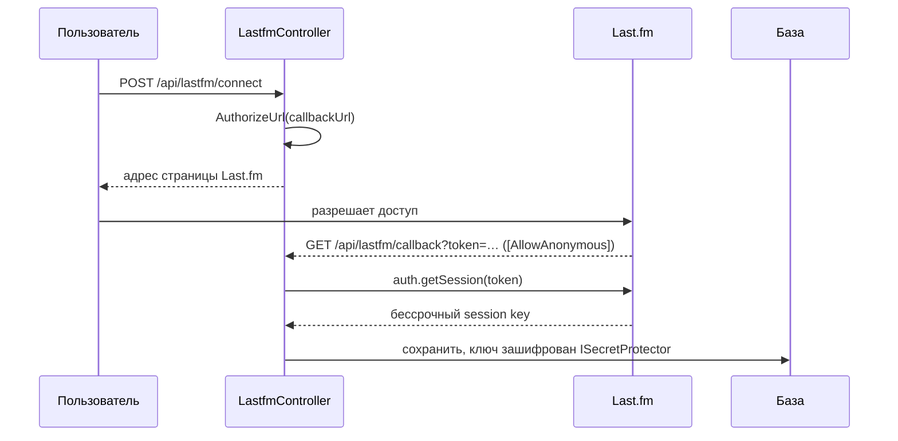
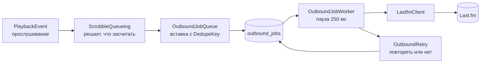

# 09. Внешние интеграции

Внешних систем всего две, и они устроены принципиально по-разному:

- **Last.fm** — исходящие доставки через долговечный outbox;
- **TheAudioDB** — разовая утилита вне основного процесса.

## Last.fm

### Подключение

[`LastfmService`](../../backend/src/MusicStreaming.Application/Services/Integrations/LastfmService.cs),
контроллер `LastfmController` (`api/lastfm`).



`GET /api/lastfm/callback` — единственная анонимная ручка вне `/api/auth`: браузер возвращается сюда
со стороны Last.fm, и своего токена у него в этот момент нет.

Ключ сессии **бессрочный**, поэтому хранится зашифрованным через `ISecretProtector` (ASP.NET Data
Protection). Колонка `lastfm_accounts.session_key` расширена до 2000 символов — шифротекст заметно
длиннее исходного ключа.

Если `Lastfm:ApiKey` или `ApiSecret` не заданы, `IsConfigured` возвращает `false`, и интеграция
клиенту **не предлагается вовсе**.

### Отправка идёт не отсюда

`LastfmService` занимается только подключением и отключением. Собственно отправкой — очередь
исходящих заданий, чтобы недоступность внешнего сервиса ничего не задерживала.



### Что засчитывается

`ScrobbleRules` в
[`ScrobbleQueueing.cs`](../../backend/src/MusicStreaming.Application/Services/Integrations/ScrobbleQueueing.cs):

```csharp
public static bool Qualifies(int listenedSeconds, int durationSeconds) =>
    durationSeconds > MinimumTrackSeconds                              // > 30 с
    && listenedSeconds >= Math.Min(durationSeconds / 2, LongEnoughSeconds);  // половина или 4 мин
```

Это правило **самого Last.fm**, а не порог истории Caimack (30 секунд). Разница принципиальна:
профиль в Last.fm складывается из всех клиентов сразу, и считать по-своему значило бы засчитывать
вдвое больше, чем любой другой проигрыватель.

Источник — тот же поток прослушиваний, из которого растут история и статистика, **а не события плеера
в браузере**: клиент не должен ни знать про Last.fm, ни ждать его, ни повторять за него запросы.

### Универсальный outbox

[`OutboundJob`](../../backend/src/MusicStreaming.Domain/Entities/Integrations/OutboundJob.cs) —
таблица, которая **ничего не знает про Last.fm**: `Kind`, непрозрачный jsonb-`Payload`, `State`,
`Attempts`, `NextAttemptAt`, `DedupeKey`.

| Компонент | Ответственность |
|---|---|
| `ScrobbleQueueing` | Из событий — в задания |
| `OutboundJobQueue` | Постановка пачкой, дедупликация |
| `OutboundJobWorker` | Разбор очереди |
| `OutboundRetry` | Единственное настоящее решение: повторять или нет |
| `LastfmClient` | HTTP и разбор ответа |

**Дедупликация — на уникальном индексе.** `OutboundJobQueue` делает предварительную выборку занятых
ключей — но только чтобы не потерять весь пакет из-за одного дубля. Окончательный ответ даёт база, а
`DbUpdateException` перехватывается:

```csharp
catch (DbUpdateException)
{
    // Кто-то успел поставить то же задание между проверкой и вставкой. Уникальный индекс
    // сработал ровно как задумано, и терять из-за этого весь пакет незачем.
    foreach (var job in fresh)
        db.OutboundJobs.Entry(job).State = EntityState.Detached;
    return 0;
}
```

**Рабочий запрос воркера** обслуживается индексом `(state, next_attempt_at)` — «что уже пора
выполнять, в порядке очереди».

### Повторы

[`OutboundRetry.DelayFor`](../../backend/src/MusicStreaming.Infrastructure/Integrations/OutboundRetry.cs)
— чистая функция, не обращается ни к базе, ни к сети, проверяется юнит-тестом:

```csharp
if (!failure.IsTransient || failure.IsAuthFailure) return null;      // бессмысленно
if (kind == OutboundJobKind.LastfmNowPlaying) return null;           // протухло
return attempts >= 1 && attempts <= Backoff.Length ? Backoff[attempts - 1] : null;
```

Выдержка: **1 мин → 5 мин → 15 мин → 1 ч → 6 ч**, после чего задание переходит в `Failed`.

Два случая не повторяются никогда:

- **отказ по существу** (неверная подпись, отозванный доступ) — ответ будет тем же, а очередь встанет;
- **«сейчас играет»** — оно живёт минуты и к следующей попытке уже ничего не значит. Это отражено и в
  комментарии к `OutboundJobKind`: `LastfmNowPlaying` «не переспрашивается», `LastfmScrobble`
  «принимается задним числом, поэтому переспрашивается долго».

### Ловушка: Last.fm отвечает 200 на ошибку

```csharp
private static readonly HashSet<int> TransientErrors = [8, 11, 16, 29];
private static readonly HashSet<int> AuthErrors = [4, 9, 14];
```

Last.fm сообщает об ошибке **полем `error` в теле, а не статусом HTTP**. Проверять `IsSuccessStatusCode`
недостаточно — `LastfmClient` разбирает тело и классифицирует код:

| Группа | Коды | Что значит |
|---|---|---|
| Временные | 8, 11, 16, 29 | Сбой сервиса, превышение частоты — пройдёт само |
| Аутентификация | 4, 9, 14 | Ключ сессии недействителен — повторять бесполезно |
| Остальные | — | Окончательный отказ |

Наверх поднимается `LastfmException` только с двумя флагами: `IsTransient` и `IsAuthFailure`. Политика
повторов ничего не знает о кодах Last.fm — это и есть граница адаптера.

HTTP-клиент зарегистрирован с собственным таймаутом в 10 секунд: внешний сервис не вправе держать
воркер дольше, чем стоит одно прослушивание.

### Как добавить второе направление

Именно ради этого outbox универсален:

1. Новое значение в `OutboundJobKind` (**дописать в конец**, значения хранятся в базе).
2. Своя запись-полезная нагрузка, сериализуемая в `Payload`.
3. Постановщик по образцу `ScrobbleQueueing`.
4. Ветка в `OutboundJobWorker` по `Kind`.
5. При необходимости — уточнение в `OutboundRetry.DelayFor`.

Новой таблицы, нового воркера и второй копии логики повторов **не требуется**. См.
[ADR-0023](adr/0023-generic-outbox.md).

## TheAudioDB — утилита изображений исполнителей

`MusicStreaming.Tools.ArtistImages` — отдельный консольный проект (3 файла, ~230 строк), собираемый
в отдельную стадию Docker-образа (`--target tools`) и запускаемый **вручную**:

```bash
docker compose --profile tools run --rm --build artist-images --limit 50
```

Почему не часть основного процесса:

- запускается **редко**, обычно один раз после наполнения библиотеки;
- ходит во внешний сервис с ограничением частоты (`AUDIODB_REQUEST_DELAY_MS`, по умолчанию 1000 мс) —
  фоновый процесс с такой паузой занимал бы поток часами;
- **не нужен** для работы приложения: без фотографий исполнителей всё работает.

Профиль `tools` в compose означает, что при обычном `docker compose up` контейнер не поднимается.

> **Важно:** не запускайте утилиту одновременно с активной загрузкой треков — обе стороны трогают
> одни и те же строки исполнителей. См. [ADR-0027](adr/0027-single-instance-deployment.md).

## Что здесь считается интеграцией

Внешние процессы, работающие не по сети, интеграциями не считаются и описаны в других главах:

- **ffmpeg** — [`07-media-pipeline.md`](07-media-pipeline.md);
- **TagLibSharp**, **ImageSharp** — там же, это библиотеки в процессе;
- **PostgreSQL** — [`05-persistence.md`](05-persistence.md).

## Куда дальше

[`10-observability.md`](10-observability.md) — как за всем этим наблюдать.
