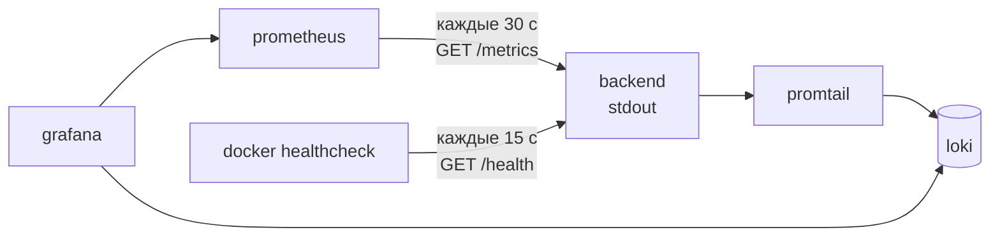

# 10. Наблюдаемость

Три канала: **логи** (Serilog → stdout → Promtail → Loki), **метрики** (OpenTelemetry → Prometheus),
**проверка живости** (`/health`). Всё сводится в Grafana.



## Логи

Настройка — [`Startup/LoggingSetup.cs`](../../backend/src/MusicStreaming.Api/Startup/LoggingSetup.cs).
Единственный приёмник — консоль:

```
[{Timestamp:HH:mm:ss} ] {Level:u3} {Message:lj}{NewLine}{Exception}
```

Файлов лога нет намеренно: в контейнере правильное место для логов — stdout, а сбором занимается
Promtail.

Уровни по умолчанию: `Information`, с понижением `Microsoft.AspNetCore` и
`Microsoft.EntityFrameworkCore.Database.Command` до `Warning`. Переопределяются секцией `Serilog` в
настройках — в `appsettings.Development.json` логирование SQL поднято до `Information`.

### Одна строка на запрос

```
GET /api/albums/019… → 200 (12.3 ms)
```

Уровень выбирается не только по статусу:

| Условие | Уровень |
|---|---|
| Клиент оборвал соединение (`WentAway`) | `Debug` |
| Исключение или 5xx | `Error` |
| «Рутинный» запрос (`Routine`) | `Debug` |
| Остальное | `Information` |

**`Routine`** — это `/health`, `/metrics` и любой запрос к `/api/tracks` с заголовком `Range`.
Без этого фильтра лог бесполезен: compose стучится в `/health` раз в 15 секунд, Prometheus в
`/metrics` — раз в 30, то есть около шести строк в минуту, в которых никогда ничего не написано.
Плюс перемотка: плеер режет поток на десятки диапазонных запросов.

Понижены до `Debug`, а **не выброшены**: сорванная проверка живости отвечает пятисоткой и до этой
ветки не доходит — её по-прежнему видно как `Error`.

**`WentAway`** — прерванный запрос всплывает как исключение, и по одному этому признаку он метился бы
ошибкой, со стектрейсом на каждую перемотку. Для SSE-потока управления воспроизведением это
невыносимо: он рвётся при каждой паузе, потому что закрытое соединение и **есть** «я больше не
играю».

### Разбор уровней в Loki

Promtail извлекает уровень регулярным выражением из формата Serilog и переводит трёхбуквенные коды в
общепринятые имена:

| Serilog | Loki |
|---|---|
| `VRB` | `trace` |
| `DBG` | `debug` |
| `INF` | `info` |
| `WRN` | `warning` |
| `ERR` | `error` |
| `FTL` | `critical` |

> **Связь, которую легко порвать:** регулярное выражение в
> [`deploy/promtail.yml`](../../deploy/promtail.yml) завязано на `outputTemplate` из `LoggingSetup.cs`.
> Измените формат вывода — метка `level` в Loki перестанет проставляться, молча. Строки при этом
> продолжат поступать, поэтому заметить можно только по фильтрам в Grafana.

Стектрейсы печатаются продолжением строки и под выражение не подпадают — они всё равно доставляются,
просто без метки уровня.

Promtail находит контейнеры **через сокет Docker**, а не по фиксированным путям, и фильтрует их по
метке `com.docker.compose.project=music-streaming`. Новый сервис в проекте подхватывается без правки
конфигурации.

> Монтирование сокета даёт promtail те же права, что и `docker` CLI на хосте — «доступа только на
> чтение» к сокету Docker не существует. Это принято как допустимое: promtail не выходит за пределы
> внутренней сети, а образ — известная неизменённая сборка.

## Метрики

[`Startup/MetricsSetup.cs`](../../backend/src/MusicStreaming.Api/Startup/MetricsSetup.cs):

```csharp
services.AddOpenTelemetry().WithMetrics(metrics => metrics
    .AddMeter(RecommendationMetrics.MeterName)   // caimack.recommendations
    .AddAspNetCoreInstrumentation()              // HTTP-запросы
    .AddRuntimeInstrumentation()                 // GC, потоки, память
    .AddPrometheusExporter());
```

Эндпоинт — `/metrics`, анонимный. Путь намеренно **не под `/api`**: Caddy пробрасывает наружу только
`/api/*` и `/health`, поэтому вынос за префикс и делает метрики доступными изнутри сети compose и
больше ниоткуда. Анонимный он потому, что учётной записи у Prometheus нет, а политика по умолчанию
требует входа.

Прикладные счётчики — в
[`RecommendationMetrics`](../../backend/src/MusicStreaming.Application/Recommendations/RecommendationMetrics.cs),
на `System.Diagnostics.Metrics`, **без зависимости от экспортёра**: слой приложения не знает, куда
уходят числа, это решает проект `Api`. Полный список — [`08-recommendations.md`](08-recommendations.md).

### Две ловушки с именами метрик

**1. Единицы измерения приклеиваются к имени.** Экспортёр Prometheus дописывает обычную единицу к
имени метрики: счётчик `playback_events_ingested_total` с единицей `events` уходил наружу как
`playback_events_ingested_total_events_total`. Дашборды запрашивали одно, существовало другое, и
панель молча показывала пустоту.

Решение — записывать единицы **аннотацией в фигурных скобках**: `{event}`, `{click}`, `{ratio}`.
Аннотацию экспортёр не приклеивает. Закреплено тестом `ExportedMetricNamesTests` — чтобы следующая
метрика не разошлась так же тихо.

**2. Prometheus 3 договаривается об UTF-8 именах.** По умолчанию он согласует UTF-8, а экспортёр
OpenTelemetry честно шлёт свои родные имена с точками (`http.server.request.duration_seconds_bucket`)
вместо подчёркиваний, под которые написаны все дашборды. Поэтому в
[`deploy/prometheus.yml`](../../deploy/prometheus.yml) протокол сбора закреплён явно:

```yaml
scrape_protocols: ["PrometheusText0.0.4"]
```

Обе ловушки объединяет одно: **они не ломают ничего заметного, а просто оставляют пустые панели.**
Если график в Grafana пуст — начните с проверки того, как метрика действительно называется в
`/metrics`.

## Проверка живости

`GET /health`, анонимный, зарегистрирован через `AddHealthChecks()` без дополнительных проверок —
отвечает «процесс жив и принимает запросы».

Используется в двух местах:

- **Docker HEALTHCHECK** — интервал 15 с, стартовый период 40 с, 5 попыток. От него зависит порядок
  запуска: фронтенд ждёт `service_healthy` бэкенда.
- **Внешний мониторинг** — Caddy пробрасывает `/health` наружу, плюс в Caddyfile есть отдельный
  слушатель на порту 8081 только для него.

Путь вынесен в константу `RequestPipelineSetup.HealthPath`, потому что его знает не только маршрут,
но и фильтр логирования.

## Версия сборки

`GET /api/system` → [`BuildInfo`](../../backend/src/MusicStreaming.Api/BuildInfo.cs): версия, короткий
хеш коммита (7 символов) и время сборки. Нужно, чтобы, глядя на интерфейс, понимать, что именно
крутится, и замечать рассинхрон фронта с бэком.

Две детали:

- **Хеш коммита.** Локально .NET SDK сам дописывает `+<sha>` к `InformationalVersion`, читая `.git`
  рядом с исходниками. В образе `.git` недоступен, поэтому хеш приходит из `-p:SourceRevisionId=`
  (аргумент сборки `GIT_SHA`, см. [`13-operations.md`](13-operations.md)). Формат в обоих случаях
  одинаковый.
- **Время сборки** берётся из mtime самой библиотеки, а не из атрибута, сгенерированного MSBuild:
  такой атрибут менялся бы при каждой сборке и заставлял перекомпилировать проект на ровном месте.
  `COPY` в Docker сохраняет время файла, так что в образе значение остаётся честным.

## Стек в compose

| Сервис | Образ | Что делает |
|---|---|---|
| `prometheus` | `prom/prometheus:v3.1.0` | Сбор метрик, хранение `PROMETHEUS_RETENTION` (30 дней) |
| `loki` | `grafana/loki:3.3.2` | Хранение логов, `LOKI_RETENTION` (720 ч) |
| `promtail` | `grafana/promtail:3.3.2` | Доставка логов из Docker в Loki |
| `grafana` | `grafana/grafana:11.5.1` | Просмотр |

Grafana публикуется на `127.0.0.1:${GRAFANA_PORT:-3001}` — только петля. Доступ снаружи — туннелем:

```bash
ssh -L 3001:127.0.0.1:3001 music.caimack   # → http://localhost:3001
ssh -L 8080:127.0.0.1:8080 music.caimack   # → http://localhost:8080/docs
```

Источники данных и дашборды подключаются автоматически из
[`deploy/grafana/provisioning/`](../../deploy/grafana/provisioning/). Готовых дашборда два:

- `backend-health.json` — запросы, задержки, ошибки, состояние среды выполнения;
- `recommendations.json` — попадания в кэш, потери событий, CTR, длительность генерации.

## Чего нет

- **Трассировки.** OpenTelemetry подключён только для метрик; экспортёра трасс нет. При одном
  процессе и синхронных вызовах распределённая трассировка мало что добавит.
- **Оповещений.** Ни Alertmanager, ни правил Grafana. Стек предназначен для разбора постфактум.
- **Структурированного JSON в логах.** Формат — человекочитаемый, потому что первый его читатель —
  человек в `docker compose logs`.

## Куда дальше

[`11-configuration.md`](11-configuration.md) — все настройки одним списком.
