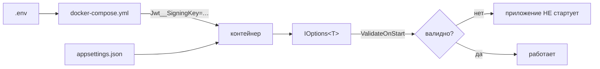

# 11. Конфигурация

## Откуда берутся значения

Стандартный порядок хоста .NET, каждый следующий перекрывает предыдущий:

1. `appsettings.json` — значения по умолчанию, входят в образ;
2. `appsettings.{Environment}.json` — только `Development`;
3. **user secrets** (`music-streaming-api`) — для локальной разработки, не в git;
4. **переменные окружения** — так настраивается бой;
5. аргументы командной строки.

Переменные окружения используют **двойное подчёркивание** как разделитель секций:
`Jwt:SigningKey` → `Jwt__SigningKey`.



**Источник правды в бою — `.env` в корне репозитория.** Шаблон —
[`.env.example`](../../.env.example), единственный отслеживаемый в git файл окружения.

> Если вы видите на диске `backend/.env` — это не используется ни одним compose-файлом. Читайте и
> правьте только корневой `.env`.

## Валидация: приложение падает на старте

Все классы настроек биндятся в
[`Infrastructure/DependencyInjection.cs`](../../backend/src/MusicStreaming.Infrastructure/DependencyInjection.cs)
цепочками `.Validate(...).ValidateOnStart()`:

```csharp
services.AddOptions<JwtOptions>()
    .Bind(configuration.GetSection(JwtOptions.SectionName))
    .Validate(o => !string.IsNullOrWhiteSpace(o.SigningKey),
        "Jwt:SigningKey is required. Set JWT_SIGNING_KEY in .env, …")
    .Validate(o => Encoding.UTF8.GetByteCount(o.SigningKey) >= MinSigningKeyBytes,
        "Jwt:SigningKey must be at least 32 bytes. Generate one with: openssl rand -base64 48")
    …
    .ValidateOnStart();
```

Это **единственное место в проекте с декларативной валидацией**, и по причине, обратной той, по
которой её нет в остальном коде ([ADR-0006](adr/0006-imperative-validation.md)): неверная настройка
не должна проявиться на первом запросе через сутки после развёртывания. Приложение обязано **не
запуститься**.

Сообщения об ошибках написаны как инструкции, а не как констатации: они называют переменную и, где
возможно, команду для получения правильного значения.

## Обязательные переменные

`docker-compose.yml` использует синтаксис `${VAR:?сообщение}` — без них compose откажется стартовать:

| Переменная | Для чего |
|---|---|
| `POSTGRES_PASSWORD` | Пароль базы |
| `JWT_SIGNING_KEY` | Подпись токенов, **32+ байта**: `openssl rand -base64 48` |
| `OWNER_PASSWORD` | Пароль первой учётной записи, минимум 8 символов |
| `GRAFANA_PASSWORD` | Вход в Grafana |
| `PUBLIC_DOMAIN` | Домен для Caddy и обратного адреса Last.fm |

> Обязательны они **всегда**, а не только при полном запуске: compose разбирает весь файл, даже если
> вы поднимаете один сервис. Поэтому `make db` падает с
> `required variable GRAFANA_PASSWORD is missing a value`, хотя Grafana при этом не стартует. См.
> [`13-operations.md`](13-operations.md).

## Полный справочник настроек

### `ConnectionStrings`

| Ключ | Переменная | Обязателен |
|---|---|---|
| `Default` | `ConnectionStrings__Default` | **да**, иначе исключение на старте |

В dev берётся из `appsettings.Development.json`
(`Host=localhost;Port=5432;Database=music;Username=music;Password=1234` — под `make db`).

### `Jwt`

| Ключ | Env | По умолчанию | Правило | Последствие изменения |
|---|---|---|---|---|
| `SigningKey` | `JWT_SIGNING_KEY` | — | ≥32 байт, не из списка утёкших | Смена **инвалидирует все выданные токены** — все выходят из системы |
| `AccessTokenMinutes` | `JWT_ACCESS_TOKEN_MINUTES` | 10 (в `appsettings.json` — 30) | > 0 | Дольше — реже обновления, но дольше живёт скомпрометированный токен и позже применяется смена роли |
| `RefreshTokenDays` | `JWT_REFRESH_TOKEN_DAYS` | 30 | > 0 | Как долго можно не вводить пароль |
| `Issuer`, `Audience` | — | `music-streaming` | — | Смена инвалидирует выданные токены |

Список известных утёкших ключей — `LeakedSigningKeys` в `Infrastructure/DependencyInjection.cs`. Туда
входит ключ, однажды попавший в публичный репозиторий; проверка нужна на случай копирования чужого
compose-файла.

### `Storage`

| Ключ | Env | По умолчанию | Правило | Комментарий |
|---|---|---|---|---|
| `RootPath` | — (`/storage` в контейнере) | `/storage` | не пусто | Том с хоста, `MUSIC_STORAGE_PATH` |
| `MaxUploadBytes` | `MAX_UPLOAD_BYTES` | 209715200 (200 МиБ) | > 0 | Согласуйте с `MAX_UPLOAD_BODY_BYTES`! |
| `MaxImageUploadBytes` | — | 8388608 (8 МиБ) | > 0 | Обложки |

> `MAX_UPLOAD_BODY_BYTES` (268435456, 256 МиБ) — **не** настройка приложения, а граница тела запроса
> в Caddy. Держать её **выше** `MAX_UPLOAD_BYTES` обязательно: тело всегда чуть больше самого файла
> из-за служебных байт multipart. См. [ADR-0025](adr/0025-upload-limits-in-three-places.md).

### `Playback`

| Ключ | Env | По умолчанию | Правило | Комментарий |
|---|---|---|---|---|
| `HistoryThresholdSeconds` | `HISTORY_THRESHOLD_SECONDS` | 30 | > 0 | Сколько нужно прослушать, чтобы трек попал в историю. **Не** порог скроббла Last.fm — у него своё правило |
| `HistoryRetentionEntries` | — | 1000 | > 0 | Сколько записей истории хранится на пользователя |

### `Transcode`

| Ключ | Env | По умолчанию | Правило |
|---|---|---|---|
| `Enabled` | `TRANSCODE_ENABLED` | `true` | — |
| `LowBitrateKbps` | `TRANSCODE_LOW_KBPS` | 64 | 32–320 |
| `NormalBitrateKbps` | `TRANSCODE_NORMAL_KBPS` | 128 | 32–320 |
| `HighBitrateKbps` | `TRANSCODE_HIGH_KBPS` | 192 | 32–320 |
| `FfmpegPath` | — | `ffmpeg` | не пусто |

Дополнительное правило: битрейты **не должны убывать** от Low к High.

Выключение `Enabled` оставляет доступной только ступень `Original` — клиент узнаёт об этом из
`/api/config`.

### `Lastfm`

| Ключ | Env | По умолчанию | Комментарий |
|---|---|---|---|
| `ApiKey` | `LASTFM_API_KEY` | пусто | Без ключа и секрета интеграция не предлагается |
| `ApiSecret` | `LASTFM_API_SECRET` | пусто | |
| `PublicUrl` | — (`https://${PUBLIC_DOMAIN}`) | пусто | Нужен для построения обратного адреса OAuth |

Валидация здесь **не** `ValidateOnStart` — интеграция необязательна.

### `Owner`

| Ключ | Env | По умолчанию | Комментарий |
|---|---|---|---|
| `Username` | `OWNER_USERNAME` | `admin` | Приводится к нижнему регистру |
| `Password` | `OWNER_PASSWORD` | — | Минимум 8 символов. Требуется, только если пользователя ещё нет |
| `DisplayName` | `OWNER_DISPLAY_NAME` | = `Username` | |
| `ResetPasswordOnStartup` | `OWNER_RESET_PASSWORD` | `false` | **Осторожно:** при `true` пароль возвращается к значению из `.env` при каждом старте |

Права владельца восстанавливаются на **каждом** старте — см. [ADR-0012](adr/0012-owner-reseeded-on-startup.md).

### `Recommendations`

Самая большая секция, около 20 правил валидации. Полный список — в
[`Options/RecommendationOptions.cs`](../../backend/src/MusicStreaming.Application/Options/RecommendationOptions.cs),
здесь — то, что реально настраивают.

**Затухание**

| Ключ | По умолчанию | Смысл |
|---|---|---|
| `TrackHalfLifeDays` | 45 | Интерес к треку убывает вдвое за столько дней |
| `ArtistHalfLifeDays` | 90 | Вкус к исполнителю меняется медленнее |
| `GenreHalfLifeDays` | 90 | То же для жанра |
| `ScoreSoftness` | 3 | Какой накопленный вес считается сильным предпочтением |
| `FreshnessWindowDays` | 30 | Сколько трек считается свежим |

> Изменение периодов полураспада **не пересчитывает** уже накопленные веса — система придёт к новому
> поведению постепенно ([ADR-0020](adr/0020-incremental-decay.md)).

**Зрелость профиля**

| Ключ | По умолчанию | Правило |
|---|---|---|
| `WarmThreshold` | 10 | ≥ 0 |
| `MatureThreshold` | 100 | > `WarmThreshold` |

**Полки**

| Ключ | Env | По умолчанию | Правило |
|---|---|---|---|
| `Enabled` | `RECOMMENDATIONS_ENABLED` | `true` | Выключает **воркеры**; чтение работает и откатывается к холодному старту |
| `ShelfSize` | `RECOMMENDATIONS_SHELF_SIZE` | 12 | > 0 |
| `CandidateLimit` | — | 600 | ≥ `ShelfSize` |
| `PerSourceLimit` | — | 120 | Потолок одного источника кандидатов |
| `SimilarTopK` | — | 50 | Сколько соседей хранится на трек |
| `ExplorationRatio` | `RECOMMENDATIONS_EXPLORATION_RATIO` | 0.25 | [0, 1] |
| `DiscoveryExplorationRatio` | — | 0.60 | [0, 1] |
| `DiversityLambda` | — | 0.30 | [0, 1) |
| `MaxPerArtist` / `MaxPerAlbum` / `MaxPerGenre` | — | 2 / 2 / 4 | > 0 |

**Штрафы** — `JustPlayedPenalty` 0.15, `RecentlyPlayedPenalty` 0.60,
`UnclickedImpressionPenalty` 0.50, `DislikedTrackPenalty` 0.10, `DislikedArtistPenalty` 0.30; окна —
`JustPlayedHours` 24, `RecentlyPlayedDays` 7, `ImpressionCooldownDays` 7.

**Похожесть и коллаборативная фильтрация** — `CollaborativeShrinkage` 5,
`CollaborativeBlendPivot` 10, `UserCfMinUsers` 5, `UserCfMinInteractions` 30. Последние два выключают
межпользовательские рекомендации, пока слушателей не станет достаточно, чтобы статистика хоть что-то
значила.

**Расписание и хранение**

| Ключ | Env | По умолчанию | Правило |
|---|---|---|---|
| `CacheTtlHours` | — | 6 | > 0 |
| `RegenerationDebounceSeconds` | — | 60 | |
| `SimilarityIntervalHours` | — | 6 | |
| `StartupDelaySeconds` | — | 30 | У `LibraryMaintenanceWorker` удваивается |
| `EventRetentionDays` | `RECOMMENDATIONS_EVENT_RETENTION_DAYS` | 180 | > 0 |
| `ImpressionRetentionDays` | — | 60 | |
| `MaxEventsPerRequest` | — | 100 | > 0 |

### `Security`

| Ключ | По умолчанию | Комментарий |
|---|---|---|
| `LoginAttemptsPerMinute` | 10 | Попыток входа с одного IP. Поднимают, когда за одним NAT живёт несколько человек |

Читается напрямую `configuration.GetValue`, без класса настроек.

### `ForwardedHeaders`

| Ключ | По умолчанию | Комментарий |
|---|---|---|
| `KnownNetworks` | `127.0.0.0/8`, `::1/128`, `10.0.0.0/8`, `172.16.0.0/12`, `192.168.0.0/16` | Кому доверять заголовки прокси |

`ForwardLimit = 1` зашит в коде: доверяется ровно один переход.

### `Cors`

| Ключ | По умолчанию | Комментарий |
|---|---|---|
| `AllowedOrigins` | `["http://localhost:3000"]` | Применяется **только** в Development |

### `Serilog`

Стандартная секция Serilog. По умолчанию `Information`, с понижением `Microsoft.AspNetCore` и
`Microsoft.EntityFrameworkCore.Database.Command` до `Warning`. В Development логирование SQL поднято
до `Information`.

## Настройки, которые задаются не приложением

| Что | Где | Комментарий |
|---|---|---|
| `MAX_UPLOAD_BODY_BYTES` | Caddy | Должно быть **выше** `MAX_UPLOAD_BYTES` |
| `PUBLIC_DOMAIN`, `HTTP_PORT`, `HTTPS_PORT` | Caddy | |
| `BACKEND_PORT`, `GRAFANA_PORT` | compose | Публикуются **только на `127.0.0.1`** |
| `PUID`, `PGID` | compose | От кого работает контейнер; том хранилища должен принадлежать им |
| `PROMETHEUS_RETENTION`, `LOKI_RETENTION` | compose | |
| `AUDIODB_API_KEY`, `AUDIODB_REQUEST_DELAY_MS` | утилита изображений | |
| `GIT_SHA` | аргумент сборки | `.git` в контекст образа не попадает |

## Локальная разработка

`appsettings.Development.json` переопределяет ровно три вещи: путь хранилища (`../../../storage`),
строку подключения к локальному Postgres и уровень логирования SQL.

Секреты для локальной разработки — user secrets, а не файл в репозитории:

```bash
cd backend/src/MusicStreaming.Api
dotnet user-secrets set "Jwt:SigningKey" "$(openssl rand -base64 48)"
dotnet user-secrets set "Owner:Password" "какой-нибудь-пароль"
```

## Как добавить настройку

1. Свойство в класс в `Application/Options/` (или новый класс с `SectionName`).
2. Значение по умолчанию — прямо в свойстве.
3. Правило в цепочку `.Validate(...)` в `Infrastructure/DependencyInjection.cs`, с внятным
   сообщением.
4. Значение в `appsettings.json`, если оно не совпадает с умолчанием в коде.
5. Проброс через `docker-compose.yml`, если оператору нужно её менять.
6. Строка в `.env.example` с комментарием.
7. Строка в таблицу выше.

Шаг 3 не пропускайте: без него неверное значение проявится не на старте, а когда-нибудь потом.

## Куда дальше

[`12-testing.md`](12-testing.md) — как проверять, что изменения ничего не сломали.
